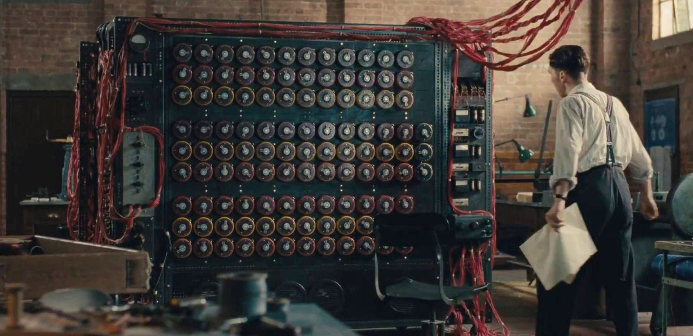

# 건축가들을 위한 생성형 AI 

### 1. AI란? 

그래서 AI가 무엇일까요? 
 

  건축 분야에서 AI(인공지능)의 중요성을 이해하고, AI가 구체적으로 무엇인지,  
<b>건축가 및 디자이너</b> 로서 얼마나 깊게 이해해야 하는지에 대해 알아봅니다. 

----

  

----
**1. 인공지능**:

큰 범주에서 인공지능(Artificial intelligence)은 기계가 인간과 유사한 지능을 발휘하도록 만드는 컴퓨터 과학의 한 분야입니다.  
인공지능은 <i>학습, 추론, 문제 해결, 지각</i> 등을 포함합니다.

#### **2. 머신러닝** 

 머신러닝은 말 그대로 기계가 (machine) 학습을 (learning) 하는 방식입니다  
 사람이 규칙을 입력하는 것이 아닌 기계가 규칙을 찾아내고, 변형에 따른 변칙을 데이터를 이용해 결과를 추론합니다.  

 <b>이 과정에서 컴퓨터는 대량의 데이터를 분석하여 숨겨진 규칙이나 패턴을 찾아내고,  
 이를 바탕으로 새로운 데이터에 대한 예측이나 결정을 할 수 있습니다.</b>. 

#### **3. 딥러닝** :

딥러닝은 머신러닝의 일종으로 기존의 머신러닝에 비해 더 크고 풍부한 역량을 지닌 모델입니다.  
훨씬 더 많은 데이터를 학습할 수 있고, 더 풍부한 규칙을 찾아낼 수 있습니다.  

딥러닝은 인간의 두뇌가 작동하는 구조를 본떠 만든 인공신경망의 새로운 이름으로  
마치 무수히 많은 다이얼을 가진 기계로 비유할 수 있습니다.

기계의 각각의 다이얼 하나 하나는 <i>인간의 뉴런</i>처럼 원하는 출력물의 가중치를 조절합니다.  
예를 들어 가장 첫번째 다이얼은 가장 작은 값을 더 높이고, 두번째 다이얼은 가장 큰 값을 낮추는 식입니다. 

이런식의 조절은 <i>결과값</i>에 영향을 미치게 되고,  
사용자는 입력 데이터를 넣고 다이얼을 돌리면서 결과물을 확인한 후(iteration) 
다시 미세 조정하면서 최대한 input 데이터와 비슷한 값을 찾게 됩니다. 

딥러닝은 이 작업을 학습을 통해 자동으로 조절합니다.  
처음에는 무작위로 다이얼을 설정하지만 학습을 진행하면서 점점 모든 다이얼이 정답에 가까워 지도록 학습합니다.

----

###2. 건축에서의 중요성?

그래서 AI는 어떤식으로 쓰일 수 있을까요?  

> 정확하게 AI를 사용하는 것은 아니지만 조금 더 넓은 범주에서,   Compuational Design은 다양한 방식으로 활용 될 수 있습니다. 그
건축 분야에서 AI는 **설계 최적화, 자동화, 시뮬레이션, 파라매트릭 디자인 제안** 등 다양한 방식으로 활용될 수 있으며 AI는 복잡한 문제를 해결하고, 더 효율적이고 지속 가능한 건축물을 설계하는 데 도움을 줄 수 있습니다.

  

- **파라메트릭 디자인**:  AI는 고객의 요구 사항과 선호를 분석하여 개인화된 디자인 솔루션을 제공할 수 있습니다. 전통적인 설계 방식을 넘어서는 창의적이고 혁신적인 디자인을 가능하게 합니다.
- **시뮬레이션**:  AI는 복잡한 환경 시뮬레이션을 통해 건축물의 성능을 예측하고, 잠재적인 문제를 사전에 파악할 수 있도록 도와줍니다. AI를 활용한 설계는 에너지 효율성을 향상시키고 환경 영향을 최소화하는 데 기여
- **설계 최적화**:  AI는 건축 설계 과정에서 최적의 설계안을 제시하며, 에너지 효율, 재료 사용, 공간 활용 등 다양한 측면에서 최적화를 도모합니다.
- **자동화**:  AI는 반복적이고 시간이 많이 소요되는 작업을 자동화함으로써, 설계자의 작업 부담을 줄이고 효율성을 향상시킵니다. AI는 설계 및 건설 과정을 최적화하여 시간과 비용을 절감

