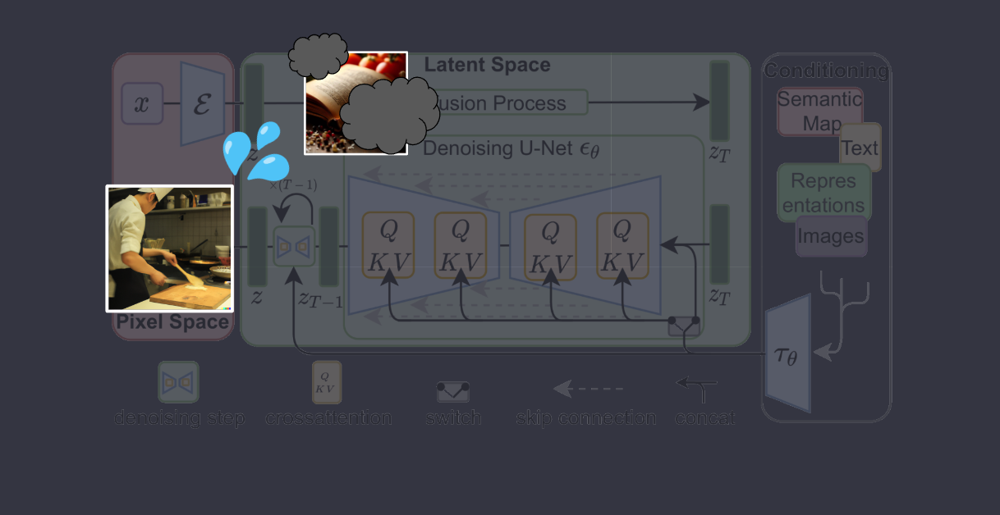
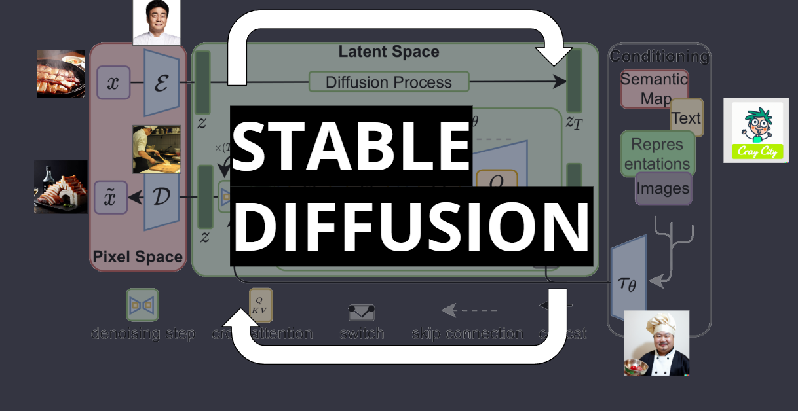

# image generation이란?

  

**현시점에 많은 AI image generator 프로그램들이 있습니다.** 

> 우선 mid-journey, stable-diffusion, dall-e가 있고  다른 서비스 들도 사용자에 맞추어 특화되어 나오고 있습니다. (정림의 archigen도 그중하나)

**모두 다른 스타일과 퀄리티로 이미지가 생성되지만 가장 중요한 이미지 생성 방법은 결국 동일합니다.**

> 단지 차이점은 이미지를 학습시키는 방법과 생성된 이미지 데이터를 수집 및 활용하는 방식입니다.
그중 Stable Diffusion은 학습과 생성 소스코드를 공개하였고, 이를 통해 사람들은 Stable Diffusion을 학습시키며 학습 모델을 만들고 발전시키면서 발전과 활용에 기여하고 있습니다.

----

> Stable diffusion 의 기본적인 알고리즘인 latent diffusion의 다이어그램은 다음과 같습니다. 
 그냥봐서는 이해하기 힘든 이 알고리즘 다이어그램을 이해하기 쉽게 하나씩 비유를 들어 설명하면,

----

> 요식업 프랜차이즈 시스템에 비유할 수 있습니다.  프렌차이즈의 본사 혹은 여기 백종원님은 원본의 요리를 받아

----

> 요리 <b>(이미지)</b> 를 압축한 레시피 <b>(벡터)</b> 를 생성하며 

----

> 반대로 가맹주<b>(디코더 D)</b>는 이 레시피로 

----

> 원래의 요리에 가까운 요리를<b>(이미지)</b>를 복원합니다. 

----

 여기까지가 <b>auto encoder</b>의 기본개념입니다. 

>이미지의 레시피화와 레시피의 실현, 이미지를 레시피 대로 복원하는 역할입니다.
 기존의 포토샵의 노이즈 제거, 간단한 이미지 복원과 같은 초기 단계의 <b>이미지 처리 알고리즘</b>이라고 생각하시면 됩니다.

----

>latent diffusion에서는 좀 더 발전된 방향으로 사용됩니다. 
어느 날 가맹점 주인(D)은 실수로 중요한 레시피 일부를 태워버렸습니다<b>(노이즈 추가(zT))</b>. 
----

>가맹주는 기억과 남은 레시피로 원래 레시피를 찾으려고 노력하고 있는데

----

> 이런상황속에, 어떤 정신나간 손님 <b>(사용자)</b>가 원하는 음식이 있다고 와서는  
추가 재료<b>(prompt, img inpaint, img2img, control-net etc)</b>를 제공하면서 원하는 음식이 있다고 만들라고 주문합니다.

----

> 프랜차이즈 본사는 새로운 메뉴전문가
<b>(새로운 인코더(t))</b>를 투입해서 가맹점 주인이(D) 추가 재료를 이해할 수 있도록 도와줍니다. 

----

> 이 새 재료전문가 <b>(새로운 인코더(t))</b>는 노이즈를 제거하는 과정에서 새로운 레시피를 만듭니다<b>(노이즈 제거)</b>.   
그리고 가맹주(D)가 요리를 만들고 이 만들어진 요리가 원본의 재료들를 통해 만들어진 것이 맞는지 테스트하고를 <b>sampling steps</b> 수 만큼 반복합니다 (Stable Diffusion의 반복 과정).
 
(두 개의 서로 다른 입력 시퀀스를 혼합 또는 결합- Value Key Query)

----

> 그리고 마침내 가맹점 주인은 손님의 요청에 따라 본사의 레시피와 새로운 아이디어를 결합해 독특하고 창의적인 요리를 만들어내고,
<b>사용자</b>는 가맹점 주인의 발전을 지켜보며 음식을 즐깁니다.

----

한줄로 비유하자면,  <b>Stable Diffusion은 이미지의 원래의 레시피에 노이즈를 추가하고 제거하는 과정을 반복하여 원하는 결과</b>를 얻는 것입니다.

----