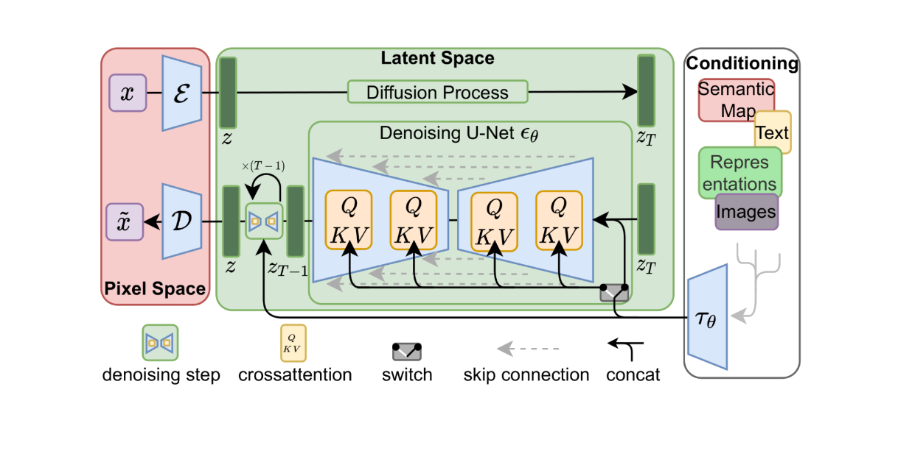
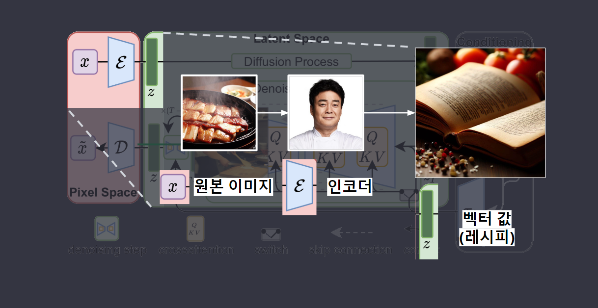
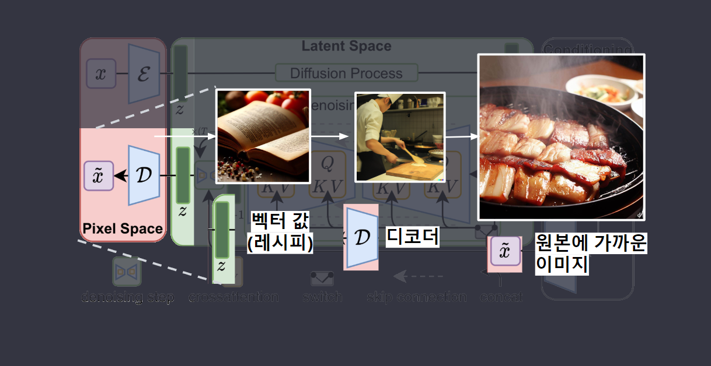
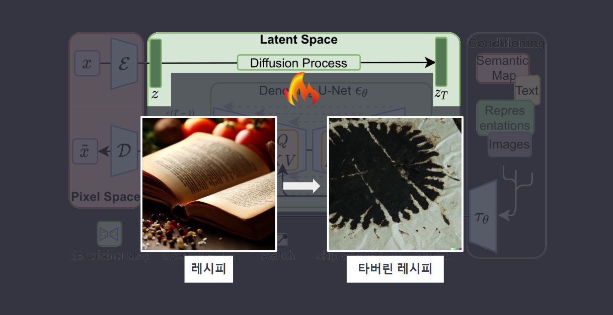
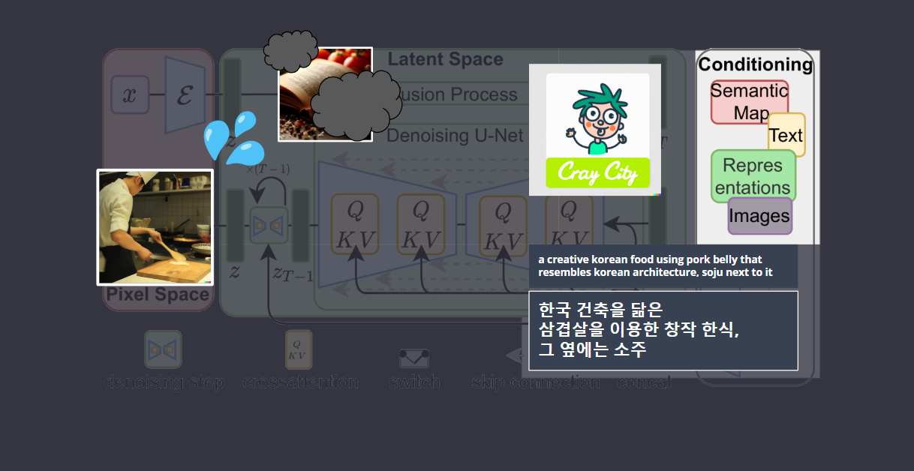
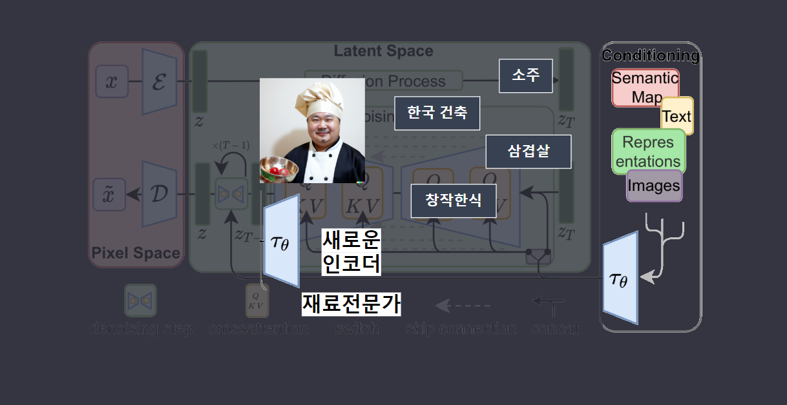
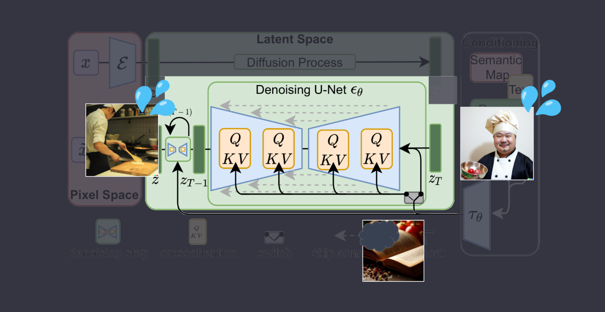
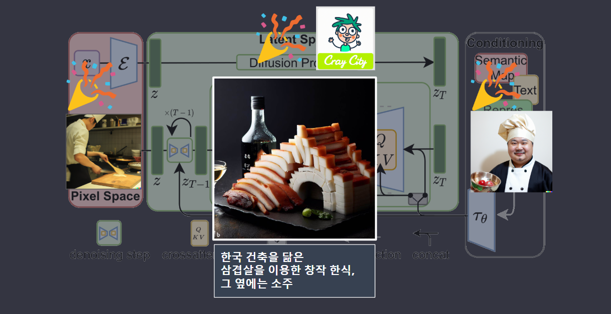

  

현시점에 많은 AI image generator 프로그램들이 있습니다. 
 우선 가장 많이 알고계시는 midjouney, stable diffusion, dall-e가 있고 다른 서비스 들도 특화되어 나오고 있습니다. 

하지만 가장 중요한 이미지 생성 방법은 결국 동일합니다. 단지 차이점은 이미지를 학습시키는 방법과 생성된 이미지 데이터를 수집 및 활용하는 방식입니다.
그중 Stable Diffusion은 학습과 생성 소스코드를 공개하였고, 이를 통해 사람들은 Stable Diffusion을 자유롭게 학습시키며 학습 모델을 만들고 발전시키면서 기술의 발전과 활용에 기여하고 있습니다.

  

stable diffusion 의 기본적인 알고리즘인 latent diffusion의 다이어그램은 다음과 같습니다. 
그냥봐서는 절대 이해 못할것처럼 생긴 이 다이어그램을 이해하기 쉽게 하나씩 비유를 들어 설명해 드리고자 합니다.

----

  

굉장히 쉽게 요식업 프랜차이즈 시스템에 비유할 수 있습니다.  본사/ 백종원님은 원본의 요리를 받아서

----

  

요리 / 이미지를 압축한 레시피(벡터)를 생성하며 

----

  

반대로 가맹주(디코더 D)는 이 레시피로 

----

  

원래의 요리에 가까운 요리를(이미지)를 복원합니다. 
 
----

  

여기까지가 auto encoder의 기본개념입니다. 이미지의 레시피화와 레시피의 실현, 이미지를 레시피 대로 복원하는 역할입니다.
기존의 포토샵의 노이즈 제거, 간단한 이미지 복원과 같은 초기 단계의 이미지 처리 알고리즘이라고 생각하시면 됩니다.

----

  

latent diffusion에서는 좀 더 발전된 방향으로 사용됩니다. 
어느 날 가맹점 주인(D)은 실수로 중요한 레시피 일부를 태워버렸습니다(노이즈 추가(zT)). 

----

  

가맹주는 기억과 남은 레시피로 원래 레시피를 찾으려고 노력하고 있는데

----

  

이런상황속에, 어떤 정신나간 손님 사용자가 원하는 음식이 있다고 와서는
추가 재료(prompt, img inpaint, img2img, control-net etc)를 제공하면서 원하는 음식이 있다고 만들라고 주문합니다.

----

  

프랜차이즈 본사는 새로운 메뉴전문가
(새로운 인코더(t))를 투입해서 가맹점 주인이(D) 추가 재료를 이해할 수 있도록 도와줍니다. 

----

  

이 새 재료전문가 (새로운 인코더(t))는 노이즈를 제거하는 과정에서 새로운 레시피를 만듭니다(노이즈 제거). 
그리고 가맹주(D)가 요리를 만들고 이 만들어진 요리가 원본의 재료들를 통해 만들어진 것이 맞는지 테스트하고를 sampling steps 수 만큼 반복합니다(Stable Diffusion의 반복 과정).
두 개의 서로 다른 입력 시퀀스를 혼합 또는 결합- Value Key Query

----

  

그리고 마침내 가맹점 주인은 손님의 요청에 따라 본사의 레시피와 새로운 아이디어를 결합해 독특하고 창의적인 요리를 만들어냅니다.  본사는 가맹점 주인의 발전을 지켜보며, 지속적으로 협력하며 발전하는 관계를 유지합니다.

----

  

한줄로 비유하자면 Stable Diffusion은 요리의 원래의 레시피에 노이즈를 추가하고 제거하는 과정을 반복하여 원하는 결과를 얻는 것입니다.

----