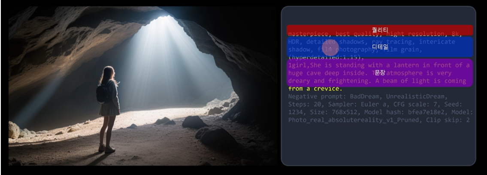
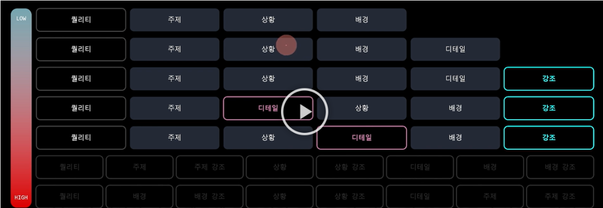

### AI와 프롬프트 기반 디자인 옵션 생성

AI가 **프롬프트를 기반**으로 다양한 디자인 옵션을 어떻게 생성하는지에 대해 탐구합니다. 프롬프트가 AI 이미지 생성 프로세스에서 어떤 역할을 하는지 설명하고, 다양한 예시를 통해 이를 시각화합니다.

### 프롬프트가 이미지 생성에 미치는 영향 및 품질 관리 방법

프롬프트의 구성이 이미지의 품질과 결과에 어떤 영향을 미치는지 탐구합니다. 예를 들어, 어떤 단어나 구문이 이미지의 세부사항, 스타일, 분위기에 영향을 미치는지 논의합니다.

  

### 프롬프트 엔지니어링 기술:

정교한 프롬프트 작성이 AI에 의해 생성되는 다양하고 구체적인 디자인 대안을 어떻게 도와주는지에 대해 설명합니다. 예를 들어, DALL-E 3와 같은 모델을 사용할 때,

  

1. **주제 설정 (Subject):**    
   이미지의 핵심을 이루는 주제나 객체를 명확하게 정의합니다.  
   예: "사막", "고양이", "미래도시"

2. **상세 묘사 (Description):**    
   주제에 대한 추가적인 세부 사항을 포함시킵니다.  
   예: "사막에 있는 낙타", "창문가에 앉아 있는 고양이", "네온 불빛이 있는 미래도시"

3. **스타일 및 분위기 (Style and Mood):**    
   이미지의 스타일이나 분위기를 묘사합니다.  
   예: "사실적인 스타일의", "만화 스타일의", "어두운 분위기의"

4. **배경 및 환경 (Background and Setting):**    
   이미지의 배경이나 설정을 설명합니다.  
   예: "해질녘 사막", "비 오는 날의 창문", "밤하늘을 배경으로 한 미래도시"

5. **색상 및 조명 (Color and Lighting):**    
   색상 팔레트, 조명, 그림자 등을 추가합니다.  
   예: "노을빛 조명의", "파스텔 색상의", "밝은 조명의"

6. **기타 특정 요소 (Additional Specific Elements):**    
   기타 중요한 요소나 특이점을 추가합니다.  
   예: "드론이 날아다니는", "반짝이는 물결이 있는"

프롬프트 작성 시, 핵심 개념이나 주제를 먼저 명시하고, 이어서 스타일, 배경, 기타 세부 사항을 추가하는 순서를 제시합니다.
