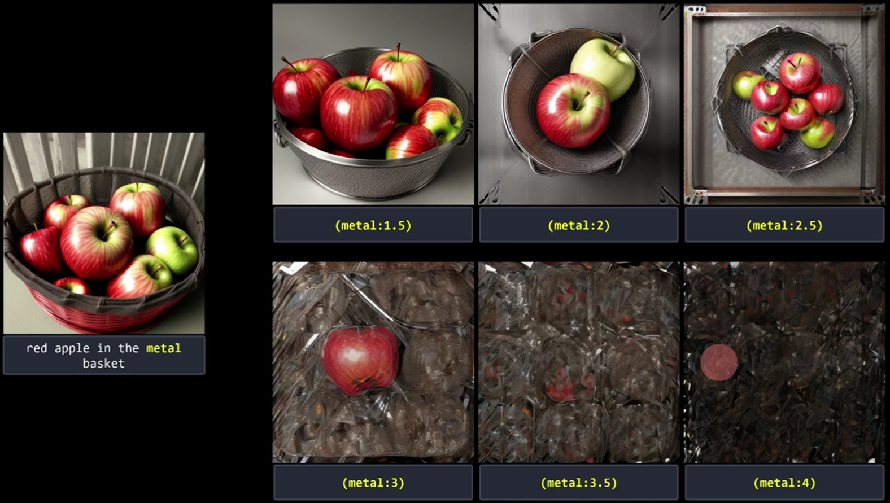
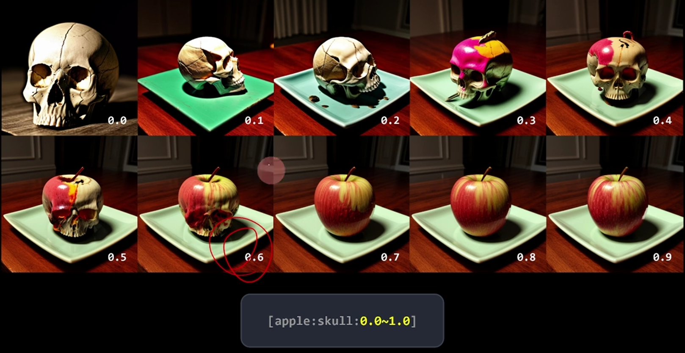

###  **AI와 프롬프트 기반 디자인 옵션 생성**

  

   > stable diffusion 모델은 "prompt" 텍스트를 벡터화하여 각 단어나 구문의 의미를 수치적으로 표현합니다. 
   
  

   어텐션 메커니즘을 통해 이러한 벡터 사이의 관계를 분석하고, 중요도에 따라 가중치를 부여하여 어텐션 맵을 생성합니다. 
   
   > 이 맵은 모델이 텍스트의 어떤 부분에 더 집중하고 있는지를 시각적으로 보여줍니다. 샘플링 스텝은 이미지 생성 과정에서 모델이 결과물을 단계별로 구축하는 방식을 나타냅니다. 
     각 스텝에서 모델은 어텐션 맵을 참조하여 이미지의 특정 부분을 더욱 세밀하게 처리하거나 특정 스타일이나 요소를 강조합니다.

  
   
   > prompt에서 작은 수정은 생성되는 attention map에 영향을 미치기 때문에 다른 이미지가 생성될 수 있습니다. 
   
----

1. **포지티브 및 네거티브 프롬프팅**

>  기본적인 prompt의 구성으로 어떤것을 생성할지를 특정요소를 text로 표현합니다. 
gpt와 같이 vectorized 된 방향을 가진 text들이 attention map을 형성하면서 이미지를 생성합니다. 
  특정 요소를 강조(포지티브)하거나 배제(네거티브)하기 위해 사용됩니다.
예: 특정 스타일이나 요소를 배제하기 위한 네거티브 프롬프트 사용.

2. **클레이 프롬프팅(Clay Prompting)**
      
> 클레이를 반죽하듯 포지티브, 네거티브 프롬프팅을 붙였다가 떼었다가를 반복하면서 반죽을 하는 단계 
프롬프트를 조작하면서 원하는 형태로 '반죽'하는 과정을 의미합니다.
창의적인 프로세스로, 초기 아이디어를 형성하고 수정하는 단계입니다.

----

### 프롬프트 구성 접근 단계

   

  

- **이미지 퀄리티 기본 요소**: 
  >1. **퀄리티**: 출력물의 품질을 결정합니다.
  >2. **배경/주제**: 디자인의 주제나 배경을 설정합니다.
  >3. **상황**: 디자인이 적용될 특정 상황이나 컨텍스트를 고려합니다.
  
- **조정 가능한 요소**:
  이후의 단계들은 필요에 따라 순서를 조정하며 사용할 수 있습니다.
  >4. **디테일**: 디자인의 세부 사항을 조절합니다.
  >5. **강조**: 특정 요소나 특징을 강조합니다.
  >6. **변화**: 디자인의 다양한 변화를 고려합니다.
  >7. **스타일**: 특정 스타일이나 방향성을 정합니다.

   

  

----

### 네거티브 임베딩

- **네거티브 임베딩**
  > 특정 요소를 제외하기 위해 사용됩니다. 올바른 그림을 만들기 위한 네거티브 프롬프트 모음입니다.

- **로라 스타일 및 텍스추얼 인버전과의 조합 주의**
  > 네거티브 임베딩은 간결하고 정교하게 사용되어야 합니다.

### 표현법의 조절

   

  

표현법 강조 

      (text)     1.1 배 강조
      ((text))   1.21배 강조 
      (text:1.3) 1.3 배 강조 

표현법 감소 
      
      [text]     1.1배 감소
      [[text]]   1.21배 감소

교차하여 섞기 
      

  

      [From:to:When] djeltj qnxj djelRKwl 
      [apple:skull:0.5] 반까지 사과 반 부터 해골 
      [apple:skull:5] 스텝수 지정 , 5 step까지 사과 6 step 부터 해골
      [apple::15]  15step 까지 apple , 16step부터 No prompt
      [skull:10]   10step 까지 no prompt, 16 step 부터 해골 

switching 
      
      [A|B] 번갈아 가면서 이미지 생성 
      [apple | orange] sampling step을 20으로 했을 경우 홀수 (1,3,5) 는 apple, (2,4,6)은 짝수 orange
      [apple | orange | ball] apple, orange, ball을 각각 1번씩 돌아가면서 정해진 step 만큼 생성 