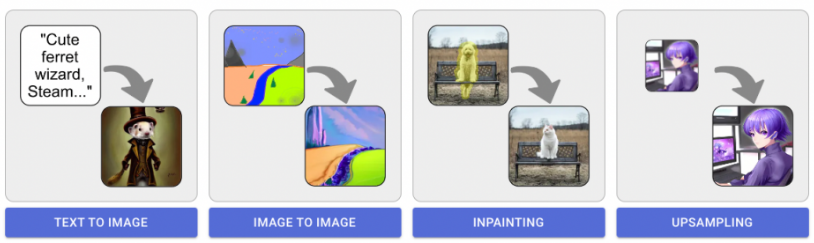

# 디자인 옵션 탐색

Stable Diffusion의 기본기능입니다 

        1. txt2img (텍스트에서 이미지 생성) 
        2. img2img (이미지에서 이미지 변형)
          2-1 inpainting (이미지의 특정 부분을 다시 그리기)
        3. Upscaling (이미지 크키 및 퀄리티 재생성)

> Stable Diffusion은 지속적으로 발전하고 있으며, 커뮤니티에 의해 다양한 addon이 개발되고 있습니다.

**Control-Net** 기능이 추가되었으며, 이를 통해 이미지의 주변 환경을 고려하여 더 자연스러운 이미지 합성이 가능해졌습니다. 
또한, gif, video, 3D 생성과 같은 기능도 개발되고 있어, 보다 광범위하게 활용될 수 있습니다.

----

  

### 1. **txt2img** (텍스트로 이미지 생성) 

> txt2img는 사용자가 입력한 프롬프트에 따라 관련 이미지를 생성해주는 핵심 기능입니다. 
이 기능을 활용하려면 **텍스트 프롬프트 (이미지로 변환하고자 하는 텍스트)**이 필요합니다. 

----

### 2. **img2img** (이미지로 이미지 생성) 

> img2img 기능은 원본 이미지에 스타일 이미지, 텍스트를 적용하여 새로운 이미지를 생성합니다. 
이 기능을 활용하려면 **원본 이미지 (스타일을 적용하고자 하는 이미지),텍스트 프롬프트 (선택 사항)**:스타일 변환의 방향을 지정하는 텍스트가 필요합니다.

> #### 2-1. **inpaint/outpaint** (이미지 마스크 지정 변경) 

> > inpaint 기능은 이미지의 변경이 필요한 구역을 지정하여 AI가 해당 구역의 이미지를 생성합니다. 
이 기능을 활용하려면 **원본 이미지 (수정하고자 하는 이미지), 마스크 변경하거나 복원할 영역을 표시한 마스크 이미지**를 설정해야 합니다.

---- 

### 3. **Upscaling** (이미지 크기 및 퀄리티 조절) 

> Upscaling은 원본 이미지의 해상도를 높이는 과정입니다. 하지만 단순히 픽셀 수를 늘리는 것이 아니라, 이미지의 품질을 개선하기 위해 추가적인 정보를 **추론하여 생성**합니다.

----

##### 추가로 control-net 모델을 설치하여 스케치, depthmap을 통해 컨트롤이 가능한 생성이 가능합니다.   control-net 모델들은 https://huggingface.co/lllyasviel/ControlNet/tree/main/models 에서 설치 가능하며 이에 대한 설명은 추후 다루도록하겠습니다. 
