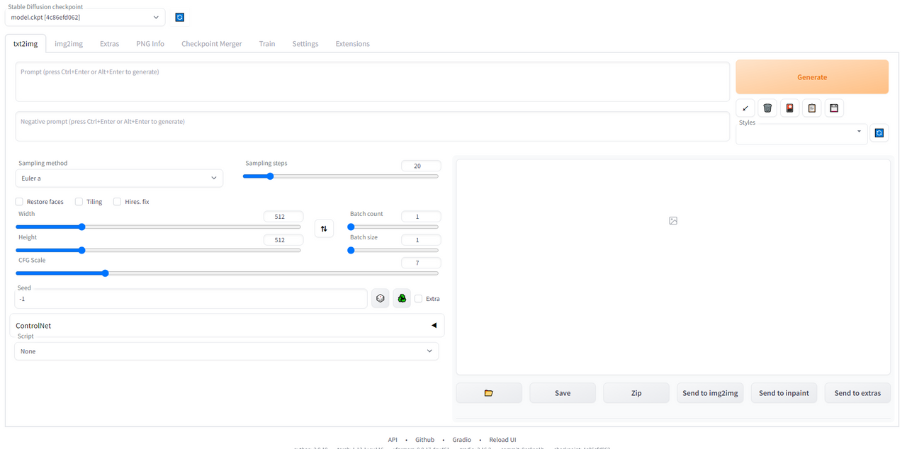
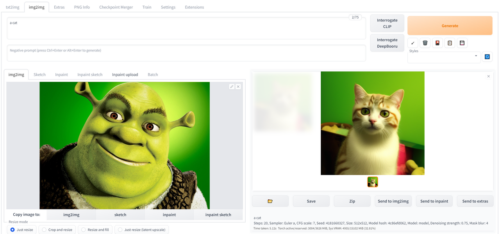
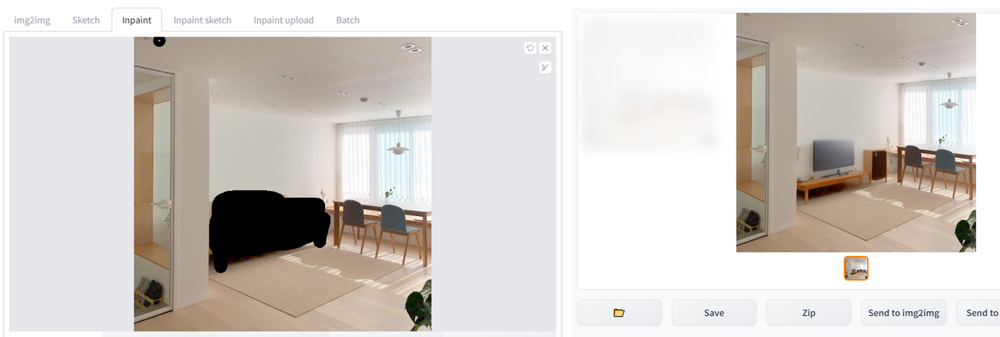

# 디자인 옵션 탐색

<table>

        <tr>
            <th>기능</th>
            <th>추가 설치 여부</th>
            <th>인풋 데이터</th>
        </tr>
        <tr>
            <td>txt2img</td>
            <td>추가 설치 X</td>
            <td>텍스트 프롬프트</td>
        </tr>
        <tr>
            <td>img2img</td>
            <td>추가 설치 X</td>
            <td>이미지 + prompt</td>
        </tr>
        <tr>
            <td>inpaint</td>
            <td>추가 설치 X</td>
            <td>이미지 + prompt + 마스킹</td>
        </tr>
        <tr>
            <td>control-net</td>
            <td>추가 설치 O</td>
            <td>스케치,depth map,ex.. + prompt</td>
        </tr> 
</table>

Stable Diffusion은 다양한 기능을 제공하는 강력한 이미지 생성 및 변형 툴입니다. 기본적으로 다음 기능을 포함합니다. 

        1. txt2img (텍스트에서 이미지 생성) 
        2. img2img (이미지에서 이미지 변형)
        3. inpainting (이미지의 특정 부분을 다시 그리기)

Stable Diffusion은 지속적으로 발전하고 있으며, 커뮤니티에 의해 다양한 addon이 개발되고 있습니다.
최근에는 Control-Net 기능이 추가되었으며, 이를 통해 이미지의 주변 환경을 고려하여 더 자연스러운 이미지 합성이 가능해졌습니다. 

또한, gif, video, 3D 이미지 생성과 같은 기능도 개발되고 있어, 이러한 도구들은 건축 디자인 분야에서도 광범위하게 활용될 수 있습니다.

----
1. **txt2img** (텍스트로 이미지 생성) 

  

txt2img는 사용자가 입력한 프롬프트에 따라 관련 이미지를 생성해주는 핵심 기능입니다. 
이 기능을 활용하려면 **텍스트 프롬프트 (이미지로 변환하고자 하는 텍스트)**이 필요합니다. 
----

2. **img2img** (이미지로 이미지 생성) 

  

img2img 기능은 원본 이미지에 스타일 이미지, 텍스트를 적용하여 새로운 이미지를 생성합니다. 
이 기능을 활용하려면 **원본 이미지 (스타일을 적용하고자 하는 이미지),텍스트 프롬프트 (선택 사항)**:스타일 변환의 방향을 지정하는 텍스트가 필요합니다.
----

3. **inpaint/outpaint** (이미지 복원 및 변경) 

  

inpaint 기능은 이미지의 변경이 필요한 구역을 지정하여 AI가 해당 구역의 이미지를 생성합니다. 
이 기능을 활용하려면 **원본 이미지 (수정하고자 하는 이미지), 마스크 변경하거나 복원할 영역을 표시한 마스크 이미지**를 설정해야 합니다.

---- 

해당 WebUi에 추가로 control-net extension 모델을 설치하여 스케치, 이미지 depth와 연결하여 지정한 이미지에 맞춘 이미지 생성이 가능합니다. 

해당 모델들은 https://huggingface.co/lllyasviel/ControlNet/tree/main/models 에서 설치 가능하며 

이에 대한 설명은 추후 다루도록하겠습니다. 
