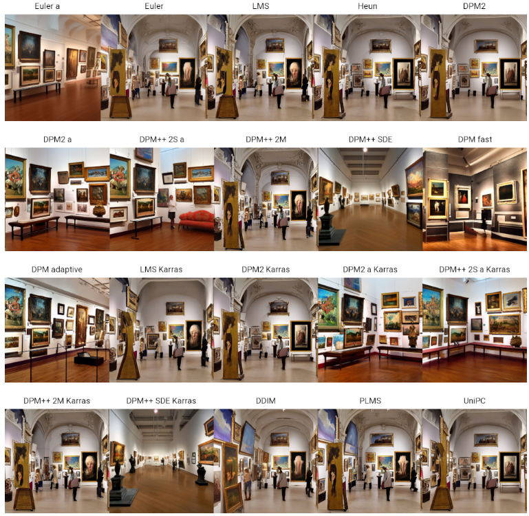

**img to Img**는 기존에 존재하는 Image를 첨부하여 또 다른 Image를 생성하는 것으로, 
첨부된 이미지에서 파생될 수 있는 여러 디자인을 생성해줍니다.

  

Txt2img 과정을 이해하기 위한 변수들을 차례대로 설명하겠습니다.

    1) Prompt (Positive Prompt / Negative Prompt)
    2) Sampling Methods
    3) Sampling Steps
    4) Size (가로, 세로)
    5) Batch
    6) CFG Scale
    7) Denoising Strength
    8) Seed
---- 

### **1. Prompt**

Img2img에서는 첨부한 Image에서 어떠한 변화를 주고자 하는지를 프롬프트에 써주시면 됩니다.

    Positive Prompt : 'A hospital building with a towering presence, glistening silver and white exterior, modernist design by Richard Meier, situated in an urban area with bright and sunny natural lighting, high definition.'    
    Negative Prompt : 'Ugly, watermark, signature, cut off, low contrast, underexposed, overexposed, beginner, amateur, blurry, grainy.'

----

### **2. Image**

변화를 주고자 하는 이미지를 선택합니다. 

  

----

### **3. Sampling Method**

  

    Prompt – A middle century art gallery with several digital art pieces
    Steps – 27
    Image Size – 512 x 512
    CFG Scale – 7
    Seed – 1573819953

#### **2-1. Sampling Method** 

> 각각의 Sampling Method는 샘플 추출 과정에 대해 다른 접근법을 제공합니다. 
 모델이 생성하려는 이미지로 벡터들이 이동하는 **방법을 결정하는 데** 중요합니다.
'Euler a' 방법을 사용하는 것이 일반적이지만, 다른 샘플러를 시도하는 것도 가능합니다.

#### **2-2. 샘플러의 영향** 

>대부분의 샘플러는 이미지를 비슷하게 생성하지만, 일부 샘플러는 큰 영향을 미칠 수 있습니다. 
 어떤 샘플러는 적은 단계로 더 잘 작동할떄, 또 어떤 샘플러는 특정 범위의 샘플링 단계에서 더 높은 품질의 이미지를 생성할 수 있습니다.

----

## **4. Sampling Steps**

  

#### **3-1 Sampling Steps**

>이미지 생성 과정의 단계를 의미하며, **품질과 스타일**에 직접적인 영향을 미칩니다.  
일반적으로 더 많은 Sampling Steps를 사용하면 더 높은 품질의 이미지를 생성할 수 있지만, 생성 시간이 더 길어집니다.   
반면, 너무 적은 Sampling Steps는 이미지의 **품질 저하**를 초래할 수 있습니다.
Sampling Steps는 이미지의 품질과 스타일, 그리고 생성 시간 사이의 균형을 맞추는 데 중요한 역할을 합니다. 따라서 상황에 맞게 조절하여 사용하는 것이 좋습니다.

----

### **4. Size**

#### **4-1 Size** 

Stable Diffusion과 같은 모델들은 특정한 이미지 사이즈,   예를 들면 512~1024의 픽셀로 트레이닝됩니다.  
> 트레이닝 사이즈는 모델이 이미지를 생성할 때 가장 효율적으로 작동하는 크기를 나타냅니다.
즉, 학습 데이터에 기반하여 비슷한 사이즈의 이미지 일때 가장 안정적이고 정확한 결과를 제공합니다.

#### **4-2 크기 증가의 영향** 

만약 트레이닝 사이즈보다 큰 이미지를 생성하려고 시도한다면, 예상치 못한 결과가 발생할 수 있습니다.
> 예를 들어, 모델이 하나의 건물 대신 두 개의 건물을 만들거나,사람의 형태가 이상하게 나타나는 경우 등이 있습니다.
 이러한 현상은 모델이 더 큰 이미지에 대해 최적화되지 않았기 때문에 발생합니다.

----
 
### **5. Batch** 

Batch 설정은 Stable Diffusion에서 한번에 생성할 이미지의 수와 단위를 결정하는 설정입니다. 

#### 5-1 배치 수
> 생성할 이미지의 총 개수를 정하는 설정입니다.

#### 5-2 배치 크기
> 한 번에 생성할 이미지의 수를 정하는 설정입니다.  
 한 번의 실행으로 몇 장의 이미지를 동시에 생성할지 결정합니다. (Vram) 사용이 늘어납니다.

----
 
### **6. CFG Scale** 

CFG Scale은 Stable Diffusion의 중요한 설정 중 하나로, 프롬프트에 얼마나 충실할 것인지 결정하는 가중치입니다.

  

    출처 : https://www.bercon.org/b24f00d3-bf56-4f3c-977e-b9de6b59ecf4

#### 6-1 CFG Scale

 프롬프트에 따른 이미지의 생성 정도를 조절합니다. 
 
 > 높은 CFG Scale 값은 프롬프트에 더 충실한 이미지를 생성하지만, 동시에 프롬프트에만 편향될 가능성이 높아집니다.
 낮은 CFG Scale 값은 더 창의적인 결과물을 얻을 수 있지만, 프롬프트와는 동떨어진 내용이 나올 수 있습니다. 
 일반적으로 7~11 범위의 CFG Scale이 적당합니다. 

----

###**7. Denoising Strength** 

  

Denoising Strength는 원본 이미지를 얼마나 변경할 것인지 결정하는 설정값입니다. 
>0부터 1 사이에서 조절할 수 있으며, 0은 원본 이미지에 변화를 주지 않음을, 1은 완전히 새로운 이미지를 생성함을 의미합니다.

----

### **8. Seed** 

  

#### 8-1 Seed

> -1을 입력하면 매번 다른 이미지가 생성되며, 특정 시드 값 입력시 비슷한 구도나 스타일의 이미지를 반복적으로 생성할 수 있습니다. 
하지만, 항상 정확히 동일한 결과를 보장하지는 않습니다.

#### 8-1 change with same seed

> 이미지의 크기 와 프롬프트를 변경하면 동일한 시드 값을 사용하더라도, 조금 다른 구도나 스타일의 이미지가 생성될 수 있습니다.
시드 값과 이미지 사이즈, 프롬프트 변경은 ControlNet을 사용하여 다양한 결과를 탐색하고 실험하는데 유용합니다. 

----