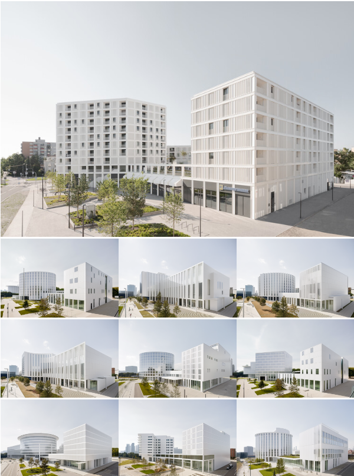
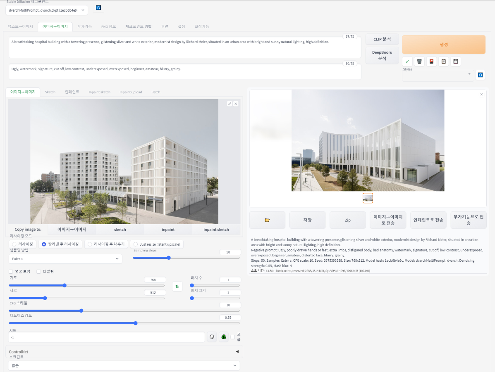

mg to Img는 기존에 존재하는 Image를 첨부하여 또 다른 Image를 생성하는 것으로,

첨부된 이미지에서 파생될 수 있는 여러 디자인을 생성해줍니다.

  

1. Prompt (Positive Prompt / Negative Prompt)
Img2img에서는 입력된 Image에 어떠한 변화(Variation)를 주고자 하는지를 프롬프트(Prompt) 입력란에 Text로 써주시면 됩니다.
본 게시글에서 입력한 Prompt는 아래와 같습니다.

Positive Prompt : 'A breathtaking hospital building with a towering presence, glistening silver and white exterior, modernist design by Richard Meier, situated in an urban area with bright and sunny natural lighting, high definition.'
Negative Prompt : 'Ugly, watermark, signature, cut off, low contrast, underexposed, overexposed, beginner, amateur, blurry, grainy.'

  

2. Image
해당 란에는 변화를 주고싶은 Image(JPEG 혹은 PNG 파일)를 끌어서 놓거나 클릭 후 첨부하면 됩니다.

3. Resizing
Resizing에는 3가지 선택지가 있으며, 각 특징은 아래 이미지와 같습니다.

  

4. Sampling Methods
Sampling Method를 변경하면 원하는 결과와 성능에 따라 다양한 방법을 시도할 수 있습니다.
각 Sampling Method는 데이터 분포로부터 샘플을 추출하는 과정에 각기 다른 접근법을 제공합니다.
기본적으로 지정되어 있는 Euler a를 사용하셔도 무방합니다.

3. Sampling Steps

  

ampling Steps의 역할: 이미지 생성 과정의 단계를 결정합니다. 이는 생성되는 이미지의 품질과 스타일에 직접적인 영향을 미칩니다.
품질과 시간의 균형: 일반적으로 더 많은 Sampling Steps를 사용하면 더 높은 품질의 이미지를 생성할 수 있지만, 생성 시간이 더 길어집니다. 반면, 너무 적은 Sampling Steps는 생성된 이미지의 품질 저하를 초래할 수 있습니다.
적절한 설정의 중요성: Sampling Steps는 생성되는 이미지의 품질과 스타일, 그리고 생성 시간 사이의 균형을 맞추는 데 중요한 역할을 합니다. 따라서 상황에 맞게 조절하여 사용하는 것이 좋습니다.

4. Size
트레이닝 사이즈의 영향: Stable Diffusion은 일반적으로 512x512 사이즈로 트레이닝됩니다. 이러한 트레이닝 사이즈는 모델이 최적화된 이미지 크기를 의미하며, 이 범위 내에서 가장 안정적인 결과를 기대할 수 있습니다.
크기 증가에 따른 변화: 이미지 크기를 트레이닝된 사이즈보다 크게 조정할 경우, 예상치 못한 결과가 발생할 수 있습니다. 예를 들어, 건물이 두 개 생성되는 현상, 사람이 두 명 나타나는 현상 등이 이에 해당합니다. 이는 모델의 'attention cloud'가 큰 이미지에서 분산되어 예상과 다른 방식으로 작동하기 때문입니다.
주의사항: 너무 큰 크기로 설정할 경우, 모델의 atte
 
5. Batch 
Batch 설정은 Stable Diffusion에서 한번에 생성할 이미지의 수와 그 생성의 단위를 결정하는 설정입니다. 

배치 수: 생성할 이미지의 총 개수를 정하는 설정입니다. 사용자가 원하는 이미지의 총량을 설정할 수 있습니다.
배치 크기: 한 번에 생성할 이미지의 수를 정하는 설정입니다. 이는 한 번의 실행으로 몇 장의 이미지를 동시에 생성할지 결정합니다.
배치 크기의 중요성: 배치 크기를 높게 설정하면 시스템에 과부하가 걸릴 수 있습니다. 따라서 안정성을 고려하여 일반적으로 배치 크기를 '1'로 설정하는 것이 권장됩니다.
 
6. CFG Scale 

CFG Scale은 Stable Diffusion의 중요한 설정 중 하나로, 프롬프트에 얼마나 충실할 것인지 결정하는 가중치입니다. 요약하면 다음과 같습니다:
  

  

CFG Scale의 역할: 프롬프트에 따른 이미지의 생성 정도를 조절합니다. 높은 CFG Scale 값은 프롬프트에 더 충실한 이미지를 생성하지만, 동시에 프롬프트에만 편향될 가능성이 높아집니다.
적정 값 설정: 일반적으로 7~11 범위의 CFG Scale이 적당합니다. 이 범위는 지시에 충분히 따르면서도 일정 수준의 창의성을 유지할 수 있습니다.
낮은 값의 효과: CFG Scale 값을 낮게 설정하면 더 창의적인 결과물을 얻을 수 있습니다.
실험적 사용: CFG Scale 값을 Sampling Steps와 함께 다양하게 조절해보면서 최적의 결과를 찾는 것이 좋습니다.

CFG Scale 역시 Sampling Steps와 같이 바꿔가며 사용하시면 됩니다.
https://www.bercon.org/b24f00d3-bf56-4f3c-977e-b9de6b59ecf4

7. Seed

  

  

시드 값 변경: -1을 입력하면 매번 다른 이미지가 생성되며, 특정 시드 값 입력시 비슷한 구도나 스타일의 이미지를 반복적으로 생성할 수 있습니다. 하지만, 항상 정확히 동일한 결과를 보장하지는 않습니다.
이미지 사이즈 변경: 이미지의 크기를 변경하면 동일한 시드 값을 사용하더라도, 조금 다른 구도나 스타일의 이미지가 생성될 수 있습니다.
프롬프트 변경: 프롬프트에 소소한 변경을 적용하면, 같은 시드 값을 사용해도 다른 스타일이나 구도의 이미지가 생성될 가능성이 있습니다.
시드 값과 이미지 사이즈, 프롬프트 변경은 ControlNet을 사용하여 다양한 결과를 탐색하고 실험하는데 유용합니다. 이러한 기능들은 사용자가 원하는 방향으로 이미지를 조정하고 다양성을 탐구할 수 있게 도와줍니다.