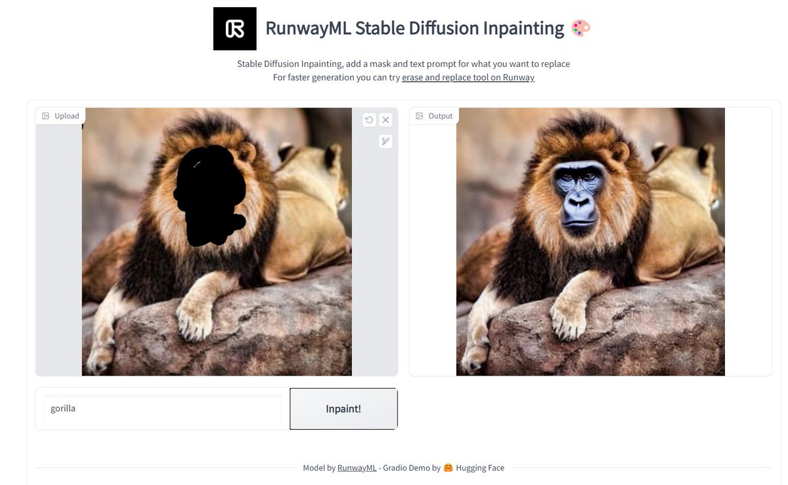
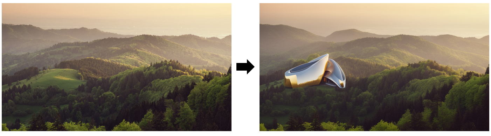
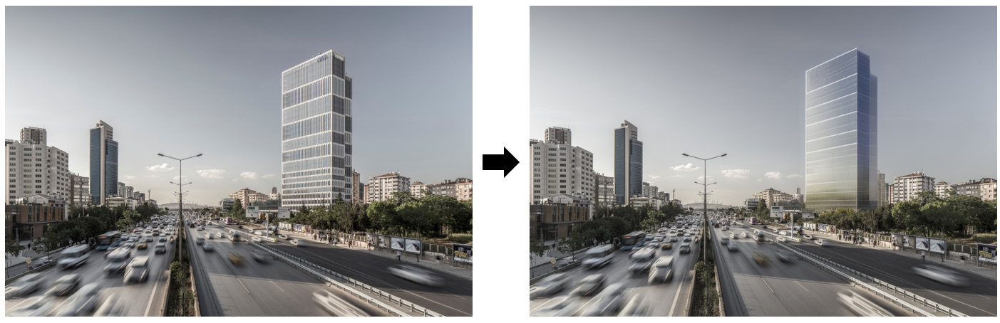
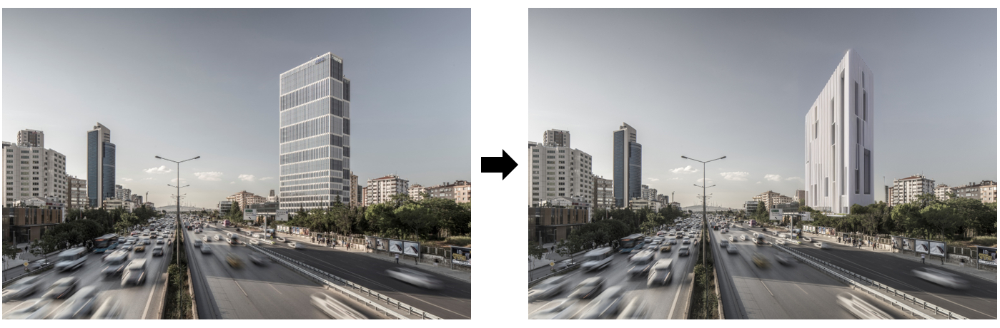
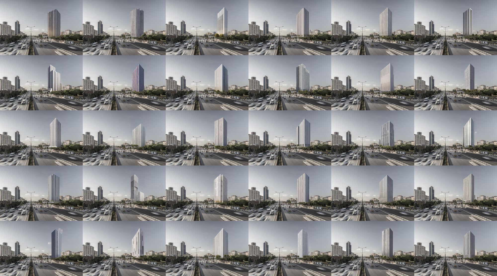
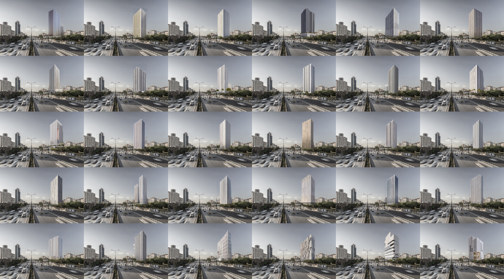
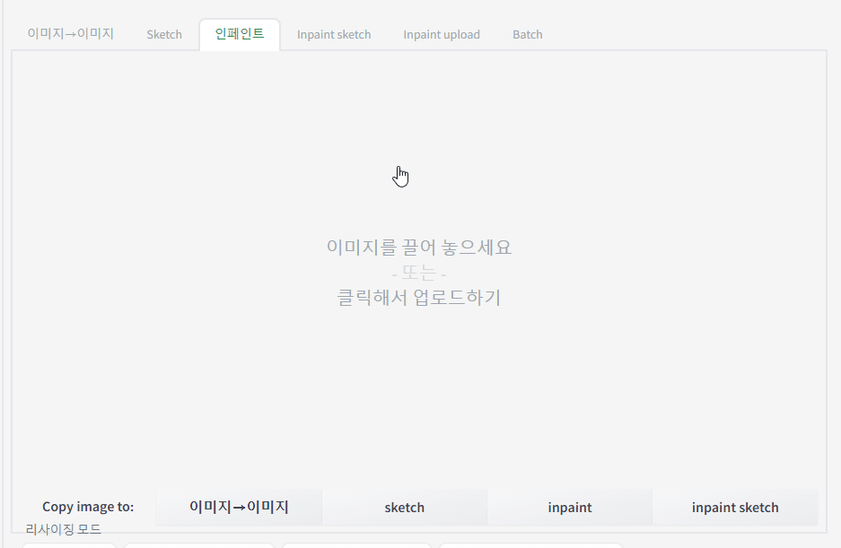
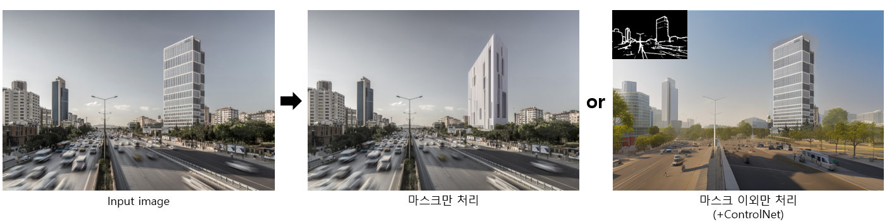
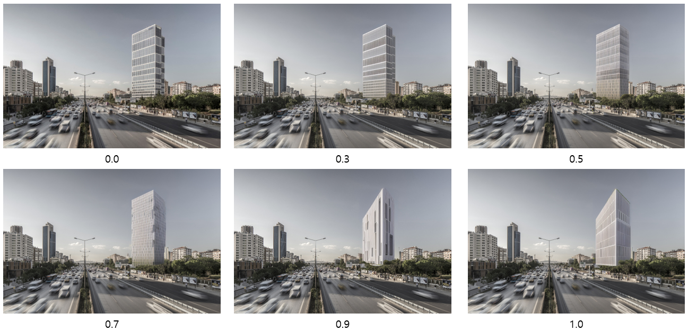

# Inpaint/Outpaint

#### 1. Inpaint

  

     출처 : https://twitter.com/huggingface/status/1582794699970347009/photo/1

 
왼쪽에는 사자의 얼굴이 칠해져 있고, 'gorilla'라고 입력되어 있습니다. 
칠해진 부분이 고릴라의 얼굴로 변한 사자의 이미지가 나타납니다.

>Inpainting 기능을 사용하면, 원하는 부분을 마스킹하고 새로운 프롬프트로 해당 영역을 변경할 수 있습니다.
빠르고 효율적인 이미지 생성을 통해 다양한 시각적 실험을 진행할 수 있습니다.

----

  

> 특정 사이트에 건물을 생성할 수도,

  

  

> 기존 건물의 리모델링을 할 수도 있습니다.

----

#### 2. Mass Study using inpaint 

inpaint 기능을 활용해 디자인 초기단계에서의 매스스터디 활용예시입니다.

  
  

    Rectangular tall office architecture, bright sunlight casting shadows on the structures, photorealistic architectural rendering in digital painting, neutral colors with splashes of vibrant accents, created using Vray, high-quality 8K UHD resolution.
    Negative prompt: Ugly, poorly drawn perspective, out of frame, watermark, signature, low contrast, underexposed, overexposed, amateur, distorted proportions, blurry, grainy.
    Steps: 50, Sampler: Euler a, CFG scale: 7, Seed: -1, Size: 768x512, Model hash: 1ecb6b4e9c, Model: jl_model, Denoising strength: 0.9, Mask blur: 4

----

Inpaint 기능은 아래와 같이 나뉩니다.
 
    1) inpaint masked  : 마스크 구역만 이미지 변경
    3) inpaint not masked : 마스크 구역이 아닌 부분 이미지 변경

----

#### 3. inpaint masked 

  

Inpainting 기능을 사용하기 위해서는 우선 마스킹할 부분을 지정해야 합니다.

Mask blur와 Padding 값의 설정은 Adobe Photoshop의 Mask 기능과 Feather 기능과 흡사합니다.
Feather 값이 높을수록 선택된 영역의 경계가 부드럽고 흐릿하게 처리되는 것 처럼
Inpainting에서도 Mask blur와 Padding 값은 유사한 역할을 합니다.

----

#### 4. Mask mode

  

Inpaint 기능에서 Mask mode를 사용하면, 특정 영역을 선택하여 그 영역만 변경하거나, 반대로 선택한 영역을 제외한 나머지 부분만 변경하는 것이 가능합니다.
이는 사용자가 원하는 부분에만 초점을 맞추거나, 특정 부분을 보존하면서 나머지를 변형시킬 수 있게 해줍니다.

    Inpaint 기능을 ControlNet과 함께 사용하면, 이미지의 주변 컨텍스트 요소를 보존하면서도 특정 부분을 정교하게 수정할 수 있습니다. ControlNet은 이미지의 전반적인 구조와 맥락을 인식하고 유지하는 기능으로, 이를 통해 이미지의 자연스러움과 일관성을 유지할 수 있습니다.

----

#### 3. Denoising Strength

  

**Denoising Strength**는 Inpainting 과정에서 원본 이미지를 얼마나 변경할 것인지 결정하는 설정값입니다. 
이 값은 0부터 1 사이에서 조절할 수 있으며, 0은 원본 이미지에 변화를 주지 않음을, 1은 Mask된 영역과 관계없이 완전히 새로운 이미지를 생성함을 의미합니다.

----