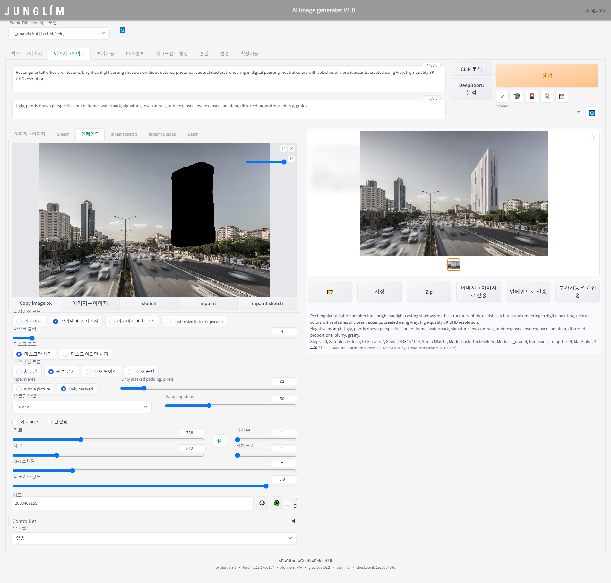

번 게시글에서는 지난번 설명드린 ControlNet에 이어 Inpaint 기능에 대해 설명드리고자 합니다.

 

  

(Source : https://twitter.com/huggingface/status/1582794699970347009/photo/1)

 

위 사진의 좌측을 보시면, 사자의 얼굴이 색칠되어 있고, 명령 프롬프트에는 'gorilla'라고 입력되어 있습니다.

그리고 그 결과로 색칠되어 있던 부분에는 우측과 같이 고릴라의 얼굴로 바뀐 사자 이미지가 생성됩니다.

이렇듯 Inpaint 기능은 원하는 영역을 Mask하고 그 영역을 새로 입력한 프롬프트로써 변경시켜주는 기능입니다.

이러한 기능을 건축디자인에 활용한다면 빠르고 간편한 이미지 생성을 통해 다양한 시도를 해보실 수 있을 것 같습니다.

그 예시를 들자면, 특정 사이트에 건물을 지어 볼 수도 있을 것이고,

  

기존 건물의 리모델링을 해보실 수도 있을 것입니다. (형상을 보존하는 것은 ControlNet을 활용하시면 됩니다.)

  

또한 기존 건축물은 없애고 재건축을 할수도 있을 것이고,

  

Stable Diffusion의 빠른 이미지 생성을 활용해 디자인 초기단계에서의 매스스터디 역시 간편할 것입니다.

(아래 이미지들은 약 1시간에 걸쳐 자동으로 생성된 100개의 이미지 중 60개의 예시이미지입니다.)

  

  

Rectangular tall office architecture, bright sunlight casting shadows on the structures, photorealistic architectural rendering in digital painting, neutral colors with splashes of vibrant accents, created using Vray, high-quality 8K UHD resolution.
Negative prompt: Ugly, poorly drawn perspective, out of frame, watermark, signature, low contrast, underexposed, overexposed, amateur, distorted proportions, blurry, grainy.
Steps: 50, Sampler: Euler a, CFG scale: 7, Seed: -1, Size: 768x512, Model hash: 1ecb6b4e9c, Model: jl_model, Denoising strength: 0.9, Mask blur: 4

이러한 Inpaint 기능을 활용하기 위해서 중점적으로 다루어야 할 요소(Factor)는 아래와 같습니다.

 

1) Mask blur & Only masked padding, pixels

2) Mask mode

3) Denoising Strength

또한 Inpaint는 Img2Img에 기반한 특수기능으로, Img2Img의 기본 설정값은

'[Stable Diffusion] Image to Image' 게시글에서 설명드린 바와 같습니다.

(Reference : https://jis.junglim.com/app/board/270/post/14377)

1) Prompt (Positive Prompt / Negative Prompt)

2) Image

3) Sampling Methods

4) Sampling Steps

5) Size (가로, 세로)

6) Batch

7) CFG Scale

8) Seed

그리고 위에 언급되지 않은 요소들은 기본값을 그대로 활용하시면 됩니다.

#1 Setting

  

해당 게시글에서 예시로 보여드린 이미지의 세팅값을 아래와 같이 예시로 보여드리며,

실습하실때 참고해주시면 감사드리겠습니다.

 

1. Mask blur & Only masked padding, pixels

  

우선, Inpaint 기능을 위해서는 바꾸고자 하는 특정부분을 색칠하여야 합니다. 그 과정은 아래 GIF와 같습니다.

  

그리고 Mask blur값과 Padding값을 입력해야하는데, Adobe Photoshop에서 Mask 기능과 Feahter 기능을 다루어보신 분이라면 해당 요소가 쉽게 이해가 되실겁니다.

Photoshop에서는 아래 오리이미지와 같이 Feather값이 높을수록 경계가 흐려지는데요,

 

Inpaint기능에서의 Mask blur 및 Padding값도 Feather와 마찬가지로 높아질수록 경계를 흐리게 해주며,

이미지의 경계가 뚜렷하거나 너무 높아질 경우 부자연스러운 합성이미지가 생성됩니다.

따라서 경계가 뚜렷할 경우에는 Mask blur 및 Padding값을 높여주시고,

아래 이미지와 같이 경계가 너무 흐려 기존이미지가 겹쳐보인다면 그 값을 낮춰주세요.

 

2. Mask mode

  

Mask mode에는 색칠한 영역만 변경할 것인지, 그 외에 영역만 변경할 것인지 선택이 가능합니다.

그에 따른 결과는 아래 이미지와 같습니다.

이때 Inpaint 기능은 ControlNet 기능과 동시에 활용할수도 있으며, 이를 활용해서 주변 컨텍스트 요소를 남길 수 있습니다.

(ControlNet에 관한 설명과 설치안내는 http://jis.junglim.com/app/board/270/post/14403를 참고해주세요)

 

3. Denoising Strength

  

Denoising Strength는 원본 이미지를 얼마나 변경할 것인지에 대한 설정값으로,

0을 입력할 경우 이미지가 변경되지 않으며,

최대값인 1을 입력할 경우 Mask된 영역과 전혀 상관없는 이미지가 생성됩니다.

 

추가로 Inpaint 기능은 Mask 영역뿐만 아니라 주변 환경도 인식하여 구도와 스케일을 반영하여 이미지가 생성됩니다.

그에 따른 이미지 생성결과는 아래와 같습니다.

 

4. 마치며

 

지금까지 Txt2Img, Img2Img와 같은 전반적인 기능과

ControlNet, Inpaint와 같은 특수기능들을 알려드렸습니다.

이것으로 Stable Diffusion의 설명을 마치며,

차후 업데이트가 있을 경우 다시 Stable Diffusion 글로 돌아오겠습니다!

 

지금까지 많은 관심 가져주신 모든 분들께 감사드립니다! 