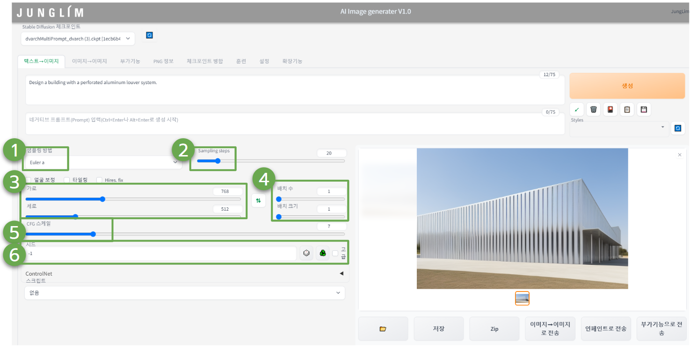

  

다양한 파라미터 조절을 통해 사용자의 요구에 부합하는 다양하고 유니크한 이미지를 생성할 수 있습니다. 
이런 설정들은 작은 변화에도 이미지의 품질과 생성 방식에 큰 차이를 만들어, 다양한 결과물을 만들어낼 수 있습니다.
----
1. 샘플링 방법(Sampling Methods) 

샘플링 방법을 변경하면, 원하는 결과와 성능에 따라 다양한 방법을 시도할 수 있습니다. 각 샘플링 방법은 데이터 분포로부터 샘플을 추출하는 과정에 다른 접근법을 제공합니다. 기본적으로 Euler a로 지정되어있습니다. 

----
2. 샘플링 단계 (Sampling steps)

 일반적으로 더 많은 단계를 사용하면 더 높은 품질의 이미지를 생성할 수 있습니다.  그러나, 단계를 너무 많이 설정하면 오히려 품질이 향상되지 않을 뿐만 아니라 생성 속도가 느려질 수 있습니다.   Stable diffusion 모델은 무작위 노이즈로 시작하여, 각 단계마다 노이즈를 조금씩 제거하는 반복적인 과정입니다. 일반적으로 20 ~60단계 정도를 사용하면 좋은 품질의 이미지 생성 가능합니다.

----
3. 출력이미지 사이즈 (가로 세로)

 「가로」와 「세로」는 출력 이미지의 사이즈 지정입니다.  이미지 크기는 그대로 VRAM의 사용량에 반영되기 때문에 VRAM이 적으면 에러가 발생하면서 생성되지 않는 경우가 있습니다.

----
4. 배치 수 / 배치 크기 

「배치 수」에서 생성하고 싶은 수를 지정하고, 「배치 크기」는 1로 해 두면 에러 없이 안정적으로 이미지 생성을 할 수 있습니다. 배치 크기는 한 번에 생성하는 이미지의 량으로 많게 설정되면 VRAM 사용량이 늘어나므로 VRAM이 적은 환경이면 오류가 발생하기 쉬워집니다. 

----
5. CFG 스케일 (classifier free guidance scale) 

 프롬프트의 지시에 얼마나 따르는지를 나타내는 값으로,  크게 하면 할수록 지시에 따른 내용이 되지만 그림 자체가 망가지기 쉽습니다. 일반적으로는 7~11이 적당하다고 되어 있습니다. 낮은 값일 수록 더욱 창의적인 결과물이 나오게 됩니다.

----
6. 시드(Seed) 

 「시드」 랜덤 씨앗으로 「-1」이라면 매번 랜덤 생성이 됩니다. 이 이미지는 잘 나왔으니까, 이 구도를 재현하고 싶다는 경우, 해당 이미지의 시드치를 입력하는 것으로, 같은 구도나 분위기는 유지하면서 다른 패턴의 이미지를 생성할 수 있습니다.

----