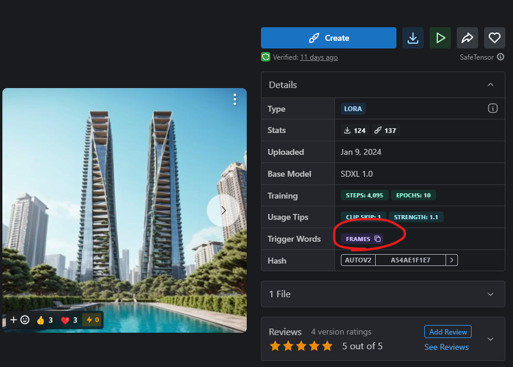

### LoRA 모델 사용법

  

스테이블디퓨전 창에서 생성 버튼의 아래에는 화투패로 보이는 버튼이 있습니다. 해당 버튼을 누르게 되면 이미지가 카드패와 같이 LoRA 모델에 해당하는 이미지들이 보여집니다. 해당 카드를 클릭시에 prompt에 자동으로 LoRA 모델은 로딩되어 사용을 할 수 있게 됩니다.

   모델을 클릭으로 로딩하면서 자동으로 LoRA 스타일이 적용되기는 하지만  Prompt창에 생성되는 이미지와 LoRA와의 연관성을 짓는 prompt를 작성하셔야 원하는 스타일에 가까운 이미지가 생성됩니다. 
  

----
####LoRA 가중치 사용

 LoRA 모델은 가중치의 수정을 통해 LoRA모델들을 섞거나, 가중치를 낮추어 얼마만큼이나 스타일을 적용할 지를 사용자가 선택할 수 있습니다.  

 LoRA를 사용하는 문법 <lora:filename:multiplier> 에서 multiplier 값은 0~1 사이로 지정하면 됩니다. 0으로 지정하면 해당 LoRA를 사용하지 않는다는 뜻이 되고, 1로 지정하면 LoRA를 완전히 강하게 적용한다는 뜻입니다.  가령 <JL_sectionplan:1>로 되어 있는 수치를 <JL_sectionplan:0.1> 로 낮추어 적용한다면 0.1 만큼의 LoRA모델이 이미지 생성에 적용되며, 이런 식으로 가중치를 조절하여 두 가지의 LoRA모델을 하나의 이미지 생성에 사용도 가능합니다.

 
<b>< JL_sectionplan:0 > 사용하지 않음</b> 
<b>< JL_sectionplan:0.5 > 반만 사용</b> 
<b>< JL_sectionplan:1 > 완전히 사용</b>

----

  

일부 LoRA 모델은 Dreambooth를 사용하여 학습하였습니다. 이 경우, LoRA 모델을 사용하려면 "발동 키워드(trigger keyword)"를 함께 사용해야 합니다. 따라서 LoRA 모델을 가져올 때 해당 페이지에 trigger keyword가 지정되어 있는지 확인할 필요가 있습니다. 아래는 지브리 스타일로 만들어주는 LoRA인데, 보시는 것처럼 트리거 키워드가 'ghibli style'로 되어 있음을 알 수 있습니다.

또한 LoRa 모델의 사용을 활성화 한뒤에 상황에 맞는 키워드 사용이 이미지 퀄리티의 차이를 불러옵니다. 예를들어 section plan의 경우 LoRA 모델을 불러온 뒤, section plan, JL_section plan과 같은 키워드가 들어간 prompt를 사용시에 더욱 퀄리티가 높고 LoRA를 사용함에 의미가 있습니다. 
 

-----
####LoRA 사용 팁
- **올바른 프롬프트 작성**: LoRA 모델은 결과물이 지정된 경우가 많으므로, 이미지에 적합한 프롬프트를 작성해야 합니다. 잘못된 프롬프트로 인해 낮은 품질의 이미지가 생성될 수 있습니다.
- **네거티브 프롬프트 사용**: 원치 않는 특성을 피하기 위해 네거티브 프롬프트(예: bad quality, bad line, bad windows)를 사용하여 더 나은 결과물을 만들 수 있습니다.
- **다양한 설정 시도**: AI 이미지 생성은 여러 시도와 수정을 통해 원하는 결과물을 얻는 이미지 툴입니다. 최적의 결과를 얻기 위해 다양한 설정을 시도해보세요.
- **다른 기술과의 결합**: 이미지와 텍스트 간의 관계를 더 세밀하게 조정하고 최적화하기 위해 LoRA와 control-net, inpaint 기능을 혼합해서 사용할 수 있습니다.
----
#### 3줄 요약
- Stable Diffusion에서 LoRA를 사용하면 사용자 정의 이미지 생성이 가능해집니다.
- LoRA 파일은 체크포인트 파일보다 훨씬 작은 용량을 가지고 있어 공유가 용이합니다.
- LoRA 모델은 가중치를 통해 얼마나 해당 특성을 적용할지를 지정할 수 있습니다.
----
### Kohya를 사용한 트레이닝 방법

 Kohya는 AI 모델을 사용자 정의하기 위한 도구 중 하나로, LoRA 기술을 활용하여 모델을 미세 조정할 수 있습니다.
 사용자는 Kohya를 통해 특정 재료나 텍스처에 대한 표본 이미지를 제공하고, 이를 기반으로 LoRA 트레이닝을 진행할 수 있습니다. 이 과정에서 모델은 제공된 표본 이미지의 특성을 학습하여, 유사한 스타일의 재료나 텍스처를 더 정확하게 생성할 수 있게 됩니다.

