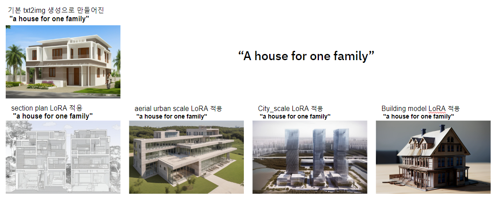
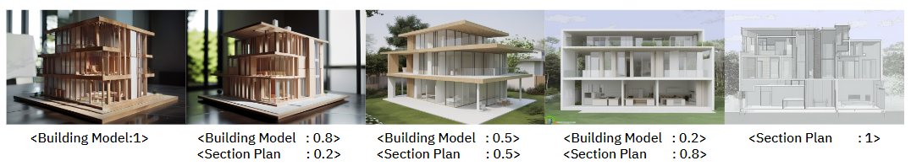
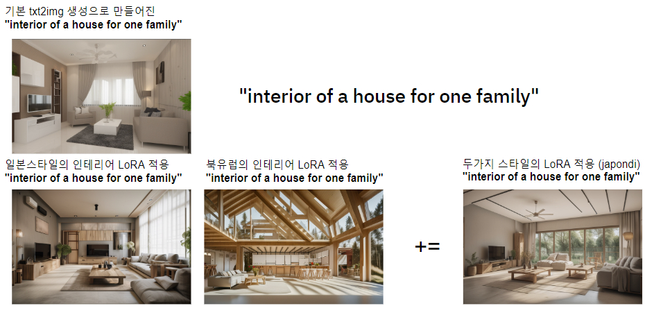

#### **LoRA의 개념**
Low-Rank Adaptation(LoRA)은 기존의 딥 러닝 모델을 소량의 데이터로도 빠르게 적응시킬 수 있는 기술입니다. 이는 모델의 특정 부분만을 미세 조정하여 새로운 임무에 적합하게 만듭니다.
LoRA는 대규모 언어 모델을 빠르고 효율적으로 조정하기 위한 기술로 개발되었으며, Stable Diffusion에서는 이미지 생성을 좀 더 사용자 정의화할 수 있는 추가 기능으로 활용됩니다.

#### **트레이닝의 필요성**
특정 스타일이나 대상을 더 정확하고 사실적으로 재현하기 위해서는 모델을 해당 재료나 텍스처의 특성에 맞게 조정하는 것이 필요합니다. 
LoRA를 사용하면 기존 모델의 구조를 크게 변경하지 않으면서도 필요한 부분에 대한 학습 효율을 극대화할 수 있습니다.

 Stable Diffusion에는 기본적으로 하나의 메인 체크포인트 파일만 사용되고 있습니다. 
 하나의 체크포인트 파일은 보통 (2GB에서 5GB) 정도로, 강화 학습이 무겁고 공유하기 어려운 점이 있습니다. 
 그러나 LoRA 파일은 적은 용량 (일반적으로 30MB ~ 100MB)으로 학습 모델을 특정 LoRA 스타일로 이미지 생성을 가능하게 합니다.

----

  

위의 사진을 보시면 같은 프롬프트인 "A house for one family" 을 사용하더라도 LoRA를 적용함으로써 각기 다른 스타일, 뷰, 상황의 이미지가 생성됨을 볼 수 있습니다. 

----

  

또한 LoRA 모델은 가중치 0 부터 1까지의 소수점 지정을 통해 두가지, 혹은 더 많은 LoRA들을 합쳐서 이미지 생성또한 가능합니다. 

----

  

이러한 스타일의 중첩과 변화는 인테리어 디자인에서 더 큰 차이와 퀄리티를 끌어올릴 수 있습니다. 

----

제공된 ZIP 파일 안에는 직접학습 시킨 8가지의 다른 건축이미지들을 학습한 LoRA 파일들이 들어 있습니다. 

해당 LoRA 파일을 사용하면 이미지 생성을 Customize할 수 있습니다. 

다음 글에서는 Stable Diffusion WebUI에서 LoRA를 사용하는 방법에 대해 자세히 다루겠습니다.

----
