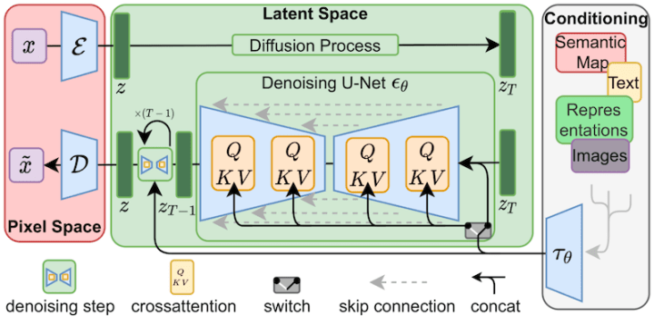

#### **LoRA의 개념**
>LoRA(낮은 순위 적응)는 소량의 데이터만 사용하여 기존 모델을 신속하게 새로운 작업에 맞게 조정할 수 있는 기술입니다. 
 이 기술은 모델의 **특정 부분**만 세밀하게 조정함으로써, Stable Diffusion에서는 LoRA를 통해 이미지 생성 과정을 사용자가 더욱 맞춤화할 수 있도록 지원합니다.

#### **LoRA 작동원리** 

LoRA는 스테이블 디퓨전 모델 중 가장 중요한 부분인 교차 인지(cross-attention) 레이어에 작은 변화를 가합니다. 여기가 이미지와 프롬프트가 만나는 지점입니다. 연구자들은 모델의 이 부분만 잘 세부조정해도 좋은 학습 결과를 달성하는데 충분하다는 것을 발견했습니다. 교차 인지 레이어는 아래의 스테이블 디퓨전 아키텍처 그림에서 노란색 부분에 해당합니다. 아래 그림은 Stable Diffusion 논문에서 가져온 것입니다.

  

#### **트레이닝의 필요성**
특정 스타일이나 대상을 더 정확하고 사실적으로 재현하기 위해서는 모델을 해당 재료나 텍스처의 특성에 맞게 조정하는 것이 필요합니다. 

LoRA를 사용하면 기존 모델의 구조를 크게 변경하지 않으면서도 필요한 부분에 대한 학습 효율을 극대화할 수 있습니다.

 > Stable Diffusion에는 기본적으로 하나의 메인 체크포인트 파일만 사용되고 있습니다. 하나의 체크포인트 파일은 보통 (2GB에서 5GB) 정도로, 강화 학습이 무겁고 공유하기 어려운 점이 있습니다. 
  그러나 LoRA 파일은 적은 용량 (일반적으로 30MB ~ 100MB)으로 학습 모델을 특정 LoRA 스타일로 이미지 생성을 가능하게 합니다.

----

  

같은 프롬프트인 "A house for one family" 을 사용하더라도 LoRA를 적용함으로써 각기 다른 스타일, 뷰, 상황의 이미지가 생성됩니다.

----

  

LoRA 모델은 가중치 0 부터 1까지의 소수점 지정을 통해 두가지, 혹은 더 많은 LoRA들을 합쳐서 이미지 생성또한 가능합니다. 

----

  

이러한 스타일의 중첩과 변화는 인테리어 디자인에서도 사용가능하며, 더 큰 차이와 퀄리티를 끌어올릴 수 있습니다. 

----

제공된 ZIP 파일에는 8가지 다른 건축 이미지를 학습한 LoRA 파일들이 포함되어 있으며, 이 파일들을 사용하여 이미지 생성을 맞춤화할 수 있습니다. 

----
