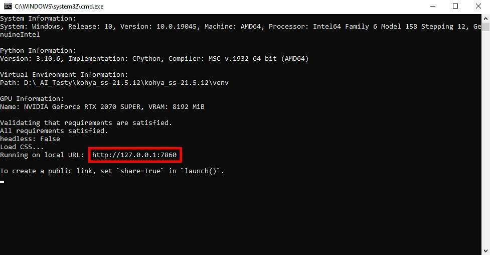
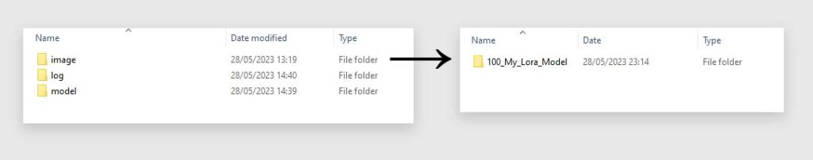
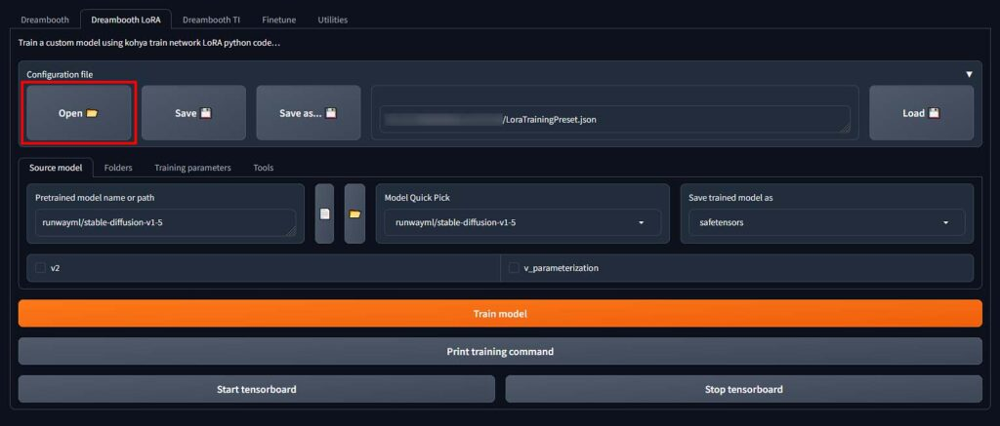

## 4단계: Kohya GUI 실행

  

- `gui.bat` 파일을 두 번 클릭하여 Kohya GUI를 시작합니다.
- GUI가 로컬 호스트의 포트 7860에서 호스팅되므로 웹 브라우저에서 "http://127.0.0.1:7860/" 주소로 접속합니다.

## 이미지 준비

  

- **이미지 세트**: LoRA 모델 교육에는 일관된 스타일의 15~100개의 고품질 이미지가 필요합니다.
- **이미지 크기 조정**: "버킷 활성화" 상자를 선택하여 다양한 크기의 이미지로 훈련할 수 있습니다.

## 훈련 시작

  

1. **폴더 준비**: `image`, `log`, `model` 세 개의 폴더를 준비합니다.

이미지 폴더에는 실제 훈련 이미지 세트가 있는 또 다른 폴더가 포함됩니다. 이 폴더는 LoRA를 훈련할 때 원하는 이미지당 훈련 단계 수에 따라 이름을 변경해야 하는 폴더입니다. 이는 매우 중요합니다.

따라서 최종 이미지 폴더 이름의 시작 부분은 하나의 이미지당 훈련 단계 수를 정의합니다. 우리의 경우 이름은 "100_My_Lora_Model"이므로 100단계로 진행하겠습니다. 자신의 이름을 선택할 수 있지만 밑줄을 빼지 마십시오!

약 10개의 이미지만 있는 경우 이 숫자를 약 150개로 설정하고, 약 20개 이상의 이미지가 있는 경우 100개로 안전하게 남겨둘 수 있습니다. 이 경우 단순화를 위해 100개로 남겨두겠습니다.

마지막 두 폴더(로그 및 모델 폴더)에는 최종 훈련된 LoRA 모델 파일과 훈련 프로세스의 로그 파일이 자동으로 저장됩니다.

2. **BLIP 캡션 추가**: 내장된 BLIP 캡션 유틸리티를 사용하여 이미지에 자동으로 캡션을 추가합니다.

> 성공적인 트레이닝을 위해서라면, 없어도 훈련은 가능 훈련이 성공하려면 훈련 세트의 각 이미지에 대한 간단한 설명이 포함된 텍스트 파일을 Kohya GUI에 제공해야 합니다. 다행스럽게도 Kohya GUI를 사용하면 BLIP 모델을 활용하여 준비한 모든 이미지에 자동으로 캡션을 추가할 수 있습니다. 유틸리티 -> 캡션 -> BLIP 캡션에서 찾을 수 있습니다.

"BLIP 캡션에 추가할 접두어" 옵션을 사용하면 생성된 모든 캡션 파일에 특정 텍스트 접두어를 자동으로 추가할 수 있습니다. 예를 들어 LoRA를 훈련하는 특정 스타일이나 캐릭터 이름과 LoRA 임베딩을 연결하려는 경우 이를 사용하세요.

예를 들어, 어떤 스타일의 사진만으로 LoRA를 훈련하기로 결정한 경우 이 옵션을 사용하여 각 캡션에 "그 스타일"이라는 접두사를 추가할 수 있습니다.

원하는 경우 접두사 외에 접미사도 추가할 수 있습니다. 이 두 가지 설정은 선택 사항입니다.

이미지가 포함된 폴더를 선택한 다음 "캡션 이미지" 버튼을 클릭하여 자동 캡션 프로세스를 시작하세요. BLIP이 완료되면 Kohya GUI 터미널에 확인 메시지가 표시됩니다.

참고: 이미지 폴더에 형식은 다르지만 동일한 파일 이름을 공유하는 이미지가 없는지 확인하세요(예: a.jpg 및 a.png). BLIP은 교육 프로세스의 효율성을 떨어뜨릴 수 있는 이러한 파일 중 하나만 선택하고 설명합니다.

캡션 프로세스가 완료된 후 .txt 파일을 수동으로 편집하여 캡션을 더욱 구체화할 수 있습니다. 이는 이미지에 BLIP에서 인식할 수 없는 비일반 요소나 문자(예: 애니메이션 캐릭터, 친구 사진 등)가 포함된 경우 특히 유용합니다.

3. **입력 권한 설정**: 제공된 구성 파일을 사용하여 설정을 조정합니다.

  

4. **모델 훈련**: 설정을 완료하고 `gui.bat` 파일을 실행하여 LoRA 모델 훈련을 시작합니다.

## 주의사항

- **네트워크 속도**: 설치 및 모델 다운로드 시 네트워크 연결 속도에 따라 시간이 다소 걸릴 수 있습니다.
- **저작권 유의**: 개인 용도로 저작권이 있는 자료를 사용할 경우 상업적 작업이나 수익 창출 목적으로 사용하지 마세요.

Kohya GUI를 통해 LoRA 모델 교육 과정을 간소화하고, 효율적으로 진행할 수 있습니다. 모든 준비가 완료되었다면, 새로운 LoRA 모델 교육을 시작해 보세요!

-------------------------

training 세팅 설명 

**batch size** 
Kohya GUI에서 배치 크기 설정은 동시에 처리할 이미지의 수를 결정합니다. 이 설정은 사용 가능한 GPU VRAM의 양에 따라 달라지며, VRAM이 많을수록 한 번에 더 많은 이미지를 처리하여 모델 훈련 속도를 높일 수 있습니다. 그러나 배치 크기를 크게 설정하면 모델의 정확도가 다소 떨어질 수 있습니다. VRAM이 8GB 이하인 경우 배치 크기를 1 또는 2로 설정하여 메모리 부족 오류를 방지하는 것이 좋으며, VRAM이 더 많은 경우에는 더 큰 배치 크기로 실험해 볼 수 있습니다. 

**Epoch**
Kohya GUI에서 에포크와 훈련 단계 설정은 모델이 훈련 데이터 세트를 얼마나 자주 반복할지 결정합니다. 한 에포크는 훈련 세트의 모든 이미지를 한 번씩 처리하는 것을 의미합니다. 예를 들어, 20개의 이미지로 구성된 데이터 세트를 40단계로 훈련시키고 3개의 에포크를 선택하면, 총 2400단계(20개 이미지 × 40단계 × 3에포크)를 진행하게 됩니다. 훈련 중 총 단계 수는 훈련 세트의 크기, 단계 수, 그리고 에포크 수에 따라 달라집니다.

일반적으로 훈련 단계가 많을수록 초기에는 모델의 성능이 개선되지만, 특정 지점 이후에는 성능이 향상되지 않거나 저하될 수 있습니다. 따라서, 실험을 통해 귀하의 목적에 가장 적합한 훈련 단계와 에포크 수를 찾는 것이 중요합니다.

Kohya GUI는 매 에포크마다 모델을 자동으로 저장하는 기능을 제공하여, 훈련 과정에서 얻은 여러 버전의 LoRA 모델 중에서 가장 성능이 좋은 모델을 선택할 수 있게 합니다. 이 기능을 활용하려면 "n epoch마다 저장" 옵션을 1로 설정합니다.

추가로, 이미지당 충분한 훈련 단계를 설정하면 단 한 번의 에포크만으로도 고품질의 LoRA 모델을 훈련시킬 수 있습니다. 이는 모델의 과잉 훈련을 방지하고 훈련 시간을 최적화하는 데 도움이 됩니다.

LoRA의 "오버베이킹" 또는 "오버트레이닝"은 모델이 훈련 데이터에 과도하게 최적화되어 새로운 데이터에 대한 일반화 능력이 떨어지는 상태를 의미합니다. 즉, 모델이 훈련 데이터를 너무 잘 학습하여, 실제 세계의 다양한 데이터에 적용할 때 오히려 성능이 저하되는 현상입니다. 과도하게 훈련된 LoRA 모델은 훈련 자료에 지나치게 의존하며, 이로 인해 생성된 이미지가 왜곡되거나 원치 않는 결과를 낳을 수 있습니다.

호출 프롬프트에서 가중치를 낮춰 약간 오버베이크된 LoRA를 사용하려고 시도할 수 있지만 일반적으로 프롬프트 가중치를 "1"로 설정하여 원하는 방식으로 정확히 작동하는 LoRA를 생성하는 것을 목표로 해야 합니다. 

**혼합 정밀도 및 저장 정밀도**
혼합 정밀도 및 저장 정밀도는 모델의 훈련과 저장 시 사용되는 데이터의 정밀도를 조정하는 설정입니다. 반정밀도(16비트)를 사용하면 메모리 사용량을 줄이고 훈련 속도를 높일 수 있지만, 정확도가 약간 감소할 수 있습니다. 그러나 대부분의 경우 이 차이는 무시할 수 있습니다.

bf16의 훈련은 fp16의 훈련보다 약간 빠르며, 둘 다 fp32의 훈련보다 빠릅니다.

## 정밀도 설정의 중요한 요소

### FP32 (32-bit Floating Point)
- **정확도**: 가장 높음
- **메모리 사용량**: 많음
- **계산 속도**: 느림
- **사용 사례**: 모델의 초기 개발, 정확도가 매우 중요한 경우

### FP16 (16-bit Floating Point)
- **정확도**: 중간 (FP32보다 낮음)
- **메모리 사용량**: 줄어듦
- **계산 속도**: 빨라짐
- **사용 사례**: 메모리 제약이 있는 환경, 대규모 모델 훈련 및 추론, 속도 향상이 필요한 경우

### BF16 (Brain Floating Point)
- **정확도**: FP32에 가까움, FP16보다 높음
- **메모리 사용량**: FP16과 동일하게 줄어듦
- **계산 속도**: FP16과 비슷하거나 더 빠름
- **사용 사례**: AI 및 딥러닝 연산 최적화, 최신 GPU에서 고성능을 요구하는 경우

### 정밀도 선택의 중요성
- **균형**: 메모리 사용량, 계산 속도, 정확도 사이의 균형을 맞춰야 함
- **적용**: Mixed Precision Training 기법을 통해 성능과 정확도의 최적 균형 달성
- **하드웨어 호환성**: 사용하는 GPU가 FP16 또는 BF16을 지원하는지 확인 필요

정밀도 설정은 모델의 성능뿐만 아니라 개발 및 운영 비용에도 직접적인 영향을 미치므로, 프로젝트의 요구 사항과 사용 가능한 리소스를 고려하여 적절한 정밀도 수준을 선택하는 것이 중요합니다.

**네트워크 순위(또는 차원)**

네트워크 순위나 차원은 LoRA 모델에서 처리할 수 있는 정보의 양을 나타내는 매개변수입니다. 이 값이 높을수록 모델은 더 많은 데이터를 저장하고 처리할 수 있지만, 그만큼 모델의 크기가 커지고 불필요한 정보가 포함될 가능성도 높아집니다. 결과적으로, 모델 파일의 크기가 커지고, 특정 상황에서는 정확도가 향상될 수 있습니다.

네트워크 순위의 설정 값은 훈련 데이터의 성격과 훈련 목표에 따라 달라집니다. 일반적으로 사용되는 값은 다음과 같습니다:

4/8: Kohya GUI의 기본 설정으로, 간단한 개념을 교육하기에 적합하지만 복잡한 개념을 다루기에는 다소 낮을 수 있습니다.
32/64: 깔끔하고 보편적인 값으로, 많은 경우에 적합합니다.
128: 캐릭터, 얼굴, 단순한 개념에 적합합니다.
256: 일반적인 아트 스타일, 대규모 이미지 훈련 세트, 세부 자료를 포함한 복잡한 개념에 적합합니다.
훈련 데이터가 더 일반적이거나 이미지의 세부 사항이 적을수록 낮은 네트워크 순위를 설정할 수 있습니다. 낮은 네트워크 순위는 얼굴과 캐릭터 스타일에, 높은 순위는 특정 아티스트 스타일과 일반적인 미학에 적합합니다.

경험상, 128이나 256보다 높은 네트워크 크기는 거의 사용되지 않으며, 간단한 문자와 개념의 경우 네트워크 순위를 2 또는 4로 설정해도 충분할 수 있습니다. 모든 설정에서 실험이 중요하며, 네트워크 크기/순위를 낮추면 VRAM 사용량이 줄어들고, 모델의 최종 크기를 제한하며, 훈련 속도가 향상되지만, 모델이 처리할 수 있는 세부 사항이 줄어들 수 있습니다.

**네트워크 알파**
네트워크 알파는 모델이 학습하는 방식을 조정하는 설정입니다. 이 설정을 통해 모델이 중요하다고 판단하는 정보의 양을 조절할 수 있습니다. 네트워크 알파 값이 크면 모델은 더 많은 정보를 중요하게 여기고, 작으면 중요한 정보만 집중합니다. 그러나 알파 값이 너무 크면 문제가 생길 수 있으니, 보통은 모델이 다루는 정보의 양(네트워크 순위)에 맞춰서 설정합니다. 시작할 때는 알파와 순위를 같게 해서 조절이 쉽도록 하고, 필요에 따라 조금씩 변경해가며 최적의 값을 찾습니다.

**옵티마이저**
옵티마이저는 훈련/학습 프로세스 중에 신경망의 가중치를 업데이트하는 역할을 담당합니다. Kohya GUI에는 선택할 수 있는 다양한 최적화 프로그램이 있으며 , 그 중에서 선택하는 것이 완전히 새로운 기사의 주제입니다. 실제로 중요한 점은 기본 AdamW 최적화 프로그램이 고품질 LoRA 학습 프로세스를 지원하는 데 아무런 문제가 없으며 막 시작할 때 이 설정을 변경할 실제 이유가 없다는 것입니다. 

**Learning rate / LR Scheduler**

### 학습률 (Learning Rate)
- **학습률**은 모델 학습 속도를 결정합니다. 높은 학습률은 모델 학습을 빠르게 하지만, 세부 사항을 놓칠 수 있습니다. 반대로, 낮은 학습률은 모델이 세부 사항을 더 잘 학습하게 하지만, 속도가 느려집니다.
- 시작 학습률로 **0.0001**을 사용하는 것이 일반적입니다. 이는 대부분의 애플리케이션에 적합한 값입니다.

### 학습률 스케줄러 (LR Scheduler)
- **학습률 스케줄러**는 학습 과정 중 학습률을 자동으로 조절합니다. 초기에는 빠른 학습을 가능하게 하고, 점차 세밀한 조정을 위해 학습률을 낮춥니다.
- **상수**와 **코사인** 스케줄러는 기본적인 학습률 스케줄러입니다. 상수는 학습률을 고정값으로 유지하고, 코사인은 학습률을 점진적으로 변경합니다.

### Kohya GUI에서의 설정
- Kohya GUI를 통해 텍스트 인코더와 U-net의 학습률을 별도로 설정할 수 있습니다. 이는 이미지 생성의 다른 측면에 민감하게 반응하도록 합니다.
- **텍스트 인코더 학습률** 조절은 이미지 생성 중 훈련 태그의 반영 속도와 정확도에 영향을 줍니다.
- **U-net 학습률** 조절은 생성된 이미지의 세부 사항과 질을 개선하는 데 중요합니다.

### 중요한 점
- 학습 배치 크기와 학습률은 서로 밀접한 관련이 있으므로, 하나를 변경할 때 다른 하나도 고려해야 합니다.
- 실험을 통해 최적의 설정을 찾는 것이 중요합니다. 특히 처음 LoRA 모델을 학습시킬 때는 기본 설정을 유지하는 것이 좋습니다.

**최대 해상도**

최대 해상도 설정은 모델 훈련에서 중요한 부분입니다. Kohya GUI의 경우, 기본 훈련 해상도는 512×512 픽셀로 설정되어 있습니다. 이는 Stable Diffusion 1.5 체크포인트를 기반으로 하는 모델에 대부분 충분합니다. 하지만, 더 큰 이미지 세트에서 LoRA를 훈련하고자 할 때는 몇 가지 고려사항이 있습니다.

최대 해상도 설정
> 기본 해상도: 512×512 픽셀. 대부분의 표준 애플리케이션에 적합합니다.
> 높은 해상도: 768×768 또는 1024×1024와 같은 더 큰 해상도를 사용하려면, VRAM 요구사항이 증가합니다. 더 큰 이미지로 훈련할수록 모델은 더 많은 VRAM을 사용합니다.
고려사항
VRAM 요구사항: 최대 훈련 해상도를 높이면 필요한 VRAM 양이 증가합니다. VRAM이 충분하지 않은 경우, 훈련 프로세스에 문제가 발생할 수 있습니다.
이미지 크기: 생성하고자 하는 이미지의 기본 크기에 가까운 해상도로 모델을 훈련시키는 것이 좋습니다. 이는 모델이 훈련된 이미지 크기에 가까운 이미지로 더 잘 작동하도록 합니다.
정확성과 세부 사항: 더 큰 이미지로 모델을 훈련시키면, 모델의 정확성과 세부 사항 표현 능력이 향상됩니다.
이미지 버킷팅
다양한 크기의 이미지 사용: 이미지 버킷팅을 통해 데이터세트에서 다양한 크기의 이미지를 효율적으로 활용할 수 있습니다. 이 방법은 데이터세트 내에서 다양한 크기의 이미지를 사용하여 모델의 범용성을 높이는 데 도움이 됩니다.

**코어당 CPU 스레드 수**
학습 중에 Kohya가 사용할 수 있는 CPU 스레드 수를 선택합니다.
이는 가장 간단한 설정 중 하나입니다. 모델을 훈련할 때 사용할 수 있는 CPU 스레드 수를 Kohya GUI에 알려줍니다. LoRA 모델 훈련은 실제로 GPU를 많이 사용하는 프로세스 이고 CPU를 많이 사용하지 않으므로 기본적으로 2개의 스레드로 설정됩니다.

코어당 스레드 수를 더 높은 값으로 설정하면 훈련 프로세스 속도가 약간 빨라질 수 있지만 대부분의 경우 큰 영향은 없습니다. 여유 코어가 있다면 자유롭게 이 설정을 최대화해 보세요!

**훈련 중 제어 이미지 생성**
훈련 중 제어 이미지 생성은 Kohya GUI를 사용하여 LoRA 모델을 훈련할 때 모델의 성능을 시각적으로 확인하는 데 도움이 되는 기능입니다. 이 기능을 통해 특정 단계나 에포크마다 선택한 프롬프트를 사용해 샘플 이미지를 자동으로 생성하여 모델이 어떻게 학습하고 있는지 평가할 수 있습니다.

훈련 중 제어 이미지 생성 설정
주기 설정: 예를 들어, 300단계마다 또는 각 에포크 후에 샘플 이미지를 생성하도록 설정할 수 있습니다. 이는 훈련 과정을 감독하고 평가하는 데 유용합니다.
프롬프트 사용: 사용자 지정 프롬프트를 설정하여 해당 프롬프트를 기반으로 하는 이미지를 생성합니다. 이를 통해 모델이 특정 주제나 스타일을 얼마나 잘 학습하고 있는지 확인할 수 있습니다.
자동 일시 중지 및 재개: 설정된 단계나 에포크에 도달하면 훈련 프로세스가 일시적으로 중지되고, 제어 이미지 생성 후 자동으로 학습이 재개됩니다.

---- 

LoRA 모델을 실제로 사용하는 데 있어서, 네트워크 크기/순위, 네트워크 알파, 옵티마이저, 학습률 같은 복잡한 설정들에 대한 깊은 이해가 반드시 필요한 것은 아닙니다. 이러한 설정들은 LoRA 모델의 성능과 결과물에 영향을 미치긴 하지만, 사용자가 모델을 단순히 사용하고자 할 때는 이런 세부적인 내용에 대해 모두 알 필요는 없습니다.

실제로 LoRA 모델을 사용할 때는 사용법을 숙지하는 것만으로 충분합니다. 모델의 설정에 대한 깊은 이해보다는, LoRA를 어떻게 실행하고 결과를 얻을 수 있는지에 초점을 맞추는 것이 더 중요합니다. 복잡한 설정들에 대한 정보는 필요할 때 참고할 수 있는 아카이브로 활용하면 됩니다.

더욱이, LoRA 설정은 다른 사용자가 만든 설정 파일을 불러오는 기능을 통해, 복잡한 설정 조정 없이도 쉽게 사용할 수 있습니다. 설정 파일을 불러오기만 하면, 이미 최적화된 설정을 통해 LoRA 모델을 사용할 수 있게 됩니다. 이는 사용자가 모델을 빠르게 사용해보고, 원하는 결과를 얻기 위한 간편한 방법을 제공합니다.