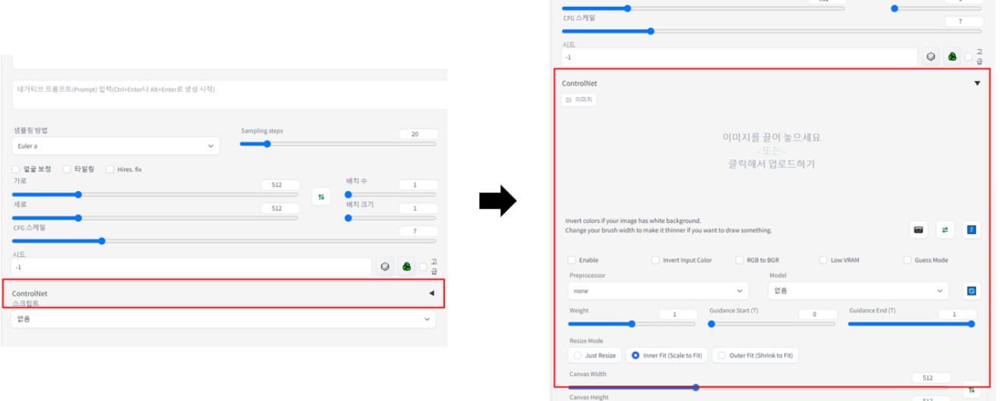
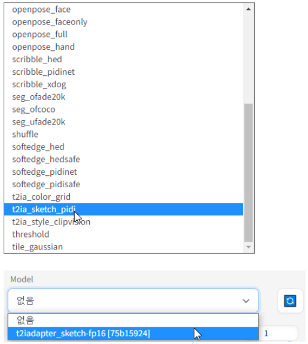
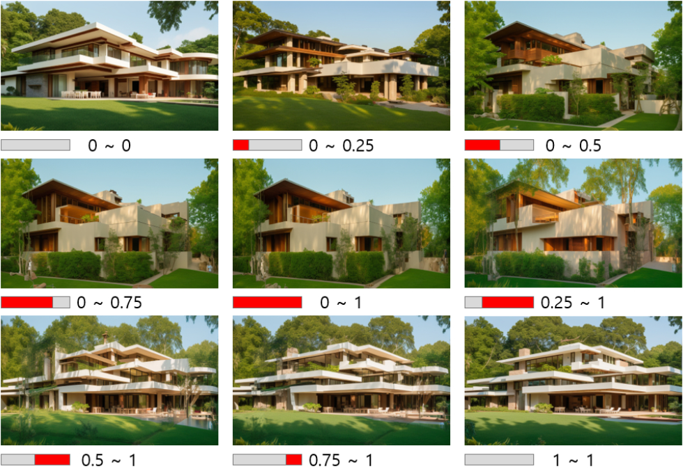
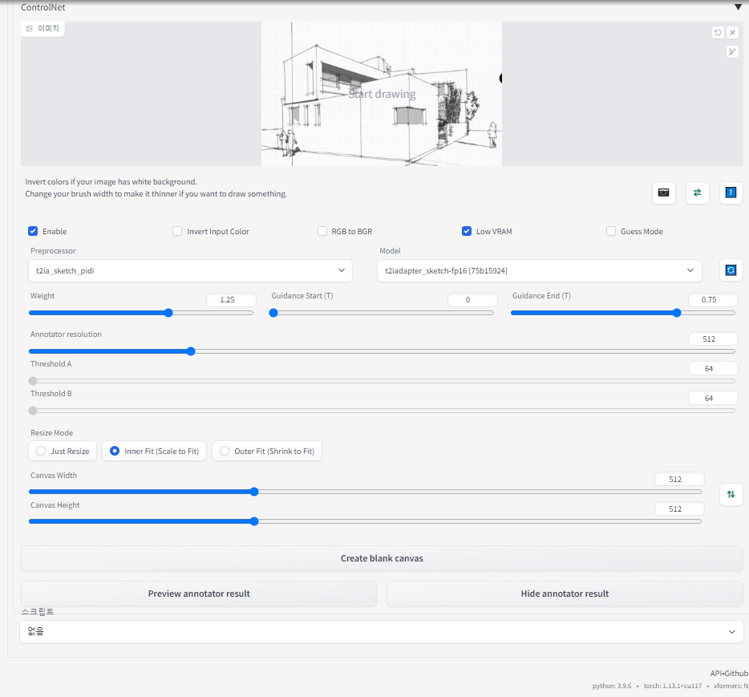

### 주변 환경 적용/ControlNet

Stable Diffusion은 텍스트에서 이미지로(txt to img) 또는 이미지에서 이미지로(img to img) 변환하는 기능을 제공하지만, 이러한 기본 기능만으로는 사용에 제한이 있을 수 있습니다. 특히, 건축과 같은 전문적인 분야에서는 더욱 세밀한 조절과 특정한 요구 사항을 충족시킬 수 있는 도구가 필요합니다. 이런 맥락에서, AI를 활용하는 가장 중요한 요소 중 하나는 사용자가 원하는 이미지를 생성하고 조절할 수 있는 능력입니다.

이를 위해, Stable Diffusion에는 'control-net'이라는 플러그인이 존재합니다. Control-net은 Stable Diffusion의 기능을 확장하여, 사용자가 더 정밀하게 이미지를 제어할 수 있도록 해줍니다. 예를 들어, 특정 이미지 영역에 대한 세부 조절이나, 특정 스타일 또는 요소의 강조 및 배제 등이 가능해집니다. 이러한 능력은 건축 분야에서 특히 중요한데, 건축 설계에서는 정확한 시각적 표현과 세밀한 조정이 필수적이기 때문입니다.

Control-net은 지속적인 기술 발전을 통해 활용 가능한 모델들을 늘려가고 있습니다. 예를 들어, 'segment everything', 'depthmap', 'scribble'과 같은 부가 모델들은 건축 분야에서 중요한 이미지 컨트롤 능력을 제공합니다. 이러한 모델들은 이미지의 깊이, 구조, 혹은 특정 부분에 대한 스케치와 같은 요소들을 더 정밀하게 표현하고 조절할 수 있게 해주어, 건축 디자인의 정확성과 창의성을 높이는 데 기여합니다.

  

 
ControlNet은 '조건을 추가하여 확산 모델을 제어하는 신경망 구조'로, 사용자가 제공한 조건(예: 스케치)에 따라 이미지를 생성합니다. 이를 통해, 사용자는 스케치나 모델링 이미지와 같은 조건을 입력하여, 해당 조건에 맞춰진 이미지를 생성할 수 있습니다. ControlNet 사용 시 중요한 요소는 사용자가 제공하는 조건의 세밀함과 정확도에 있습니다.

  
  

1) Weight
2) Guidance (Start, End)
3) Annotator resolution
4) Canvas Size (Width, Height)
5) Preview annotator result
----

Weight는 ControlNet에 입력한 이미지의 영향을 얼마나 줄 것인지에 대한 수치입니다.

  

Weight: ControlNet에 입력한 이미지의 영향 정도를 결정하는 수치. 0에서 2 사이에서 조절 가능. 0.75~1.25 범위가 권장됨.
0~0.5가 되더라도 생성되는 건축물의 구도는 일정함을 볼 수 있습니다
----
4. Guidance (Start, End)

Guidance는 ControlNet이 적용되는 구간을 입력하는 것으로,
0에서 1까지 범위를 Start, End로 나누어 입력할 수 있습니다.
그리고 그에 대한 결과 이미지는 아래와 같습니다.

  

Guidance Start가 0이고 Guidance End가 1일 경우 이미지가 생성되는 처음 단계부터 마지막 단계까지 ControlNet이 적용되며,

이 경우 ControlNet에 입력된 스케치를 최대한 따라가는 것을 볼 수 있습니다.
반면, 0~0이거나 1~1일 경우 스케치의 구도만 반영될 뿐 별개의 이미지가 생성되고 있습니다.
그 외에 0.5~1, 0.75~1의 경우에는 별개의 이미지가 생성되던 중에 스케치가 개입되어 깨지는 현상이 보입니다.
따라서 가장 권장드리는 수치는 0~0.5(스케치로부터의 자유도 상승) 혹은 0~1(최대한 스케치와 일치)가 되겠습니다.

----
5. Annotator resolution
Annotator resolution은 ControlNet의 Sketch를 더욱 섬세하게 인식하는 정도로,

아래와 같은 인식정도를 볼 수 있습니다.

  

ControlNet은 높은 GPU와 메모리를 필요로 하며, Annotator resolution이 컴퓨터 성능에 비해 높아질 경우 오류가 날 수 있습니다.

따라서 오류가 날 경우에는 Annotator resolution를 줄이시면 문제가 해결됩니다.

----

6. Canvas Size (Width, Height)
Canvas Size는 생성되는 이미지의 크기가 아니고 ControlNet에 입력되는 스케치의 사이즈를 입력하는 것입니다.

하지만 Canvas Size에 입력된 수치가 높다고 해서 이미지 생성 결과가 더 정확해지는 정도는 미비하므로

장변이 512를 안 넘는 것을 권장드립니다.

----
7. Preview annotator result

Preview annotator result는 ControlNet에 입력된 스케치가 어떻게 인식되는지 미리볼 수 있는 기능으로,

아래 GIF와 같이 Preview 및 Hide를 통해 켜고 끌 수 있습니다

  

----

'ControlNet is a neural network structure to control diffusion models by adding extra conditions'
(Source : https://github.com/lllyasviel/ControlNet)