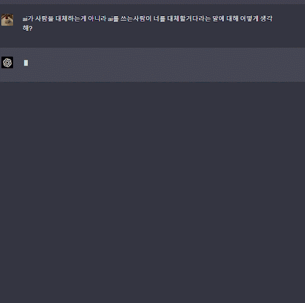
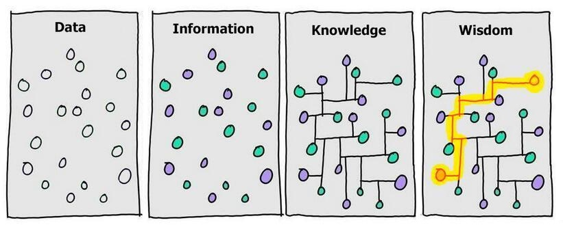
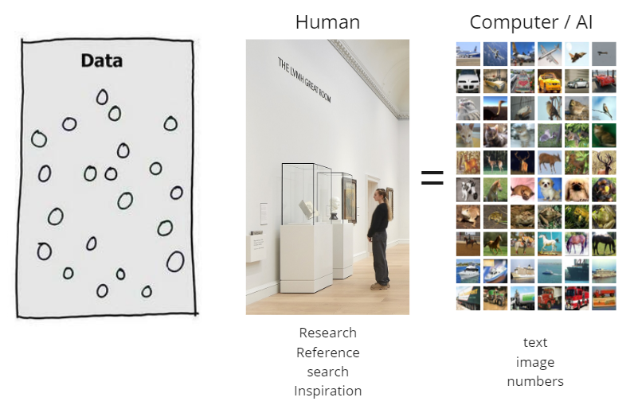
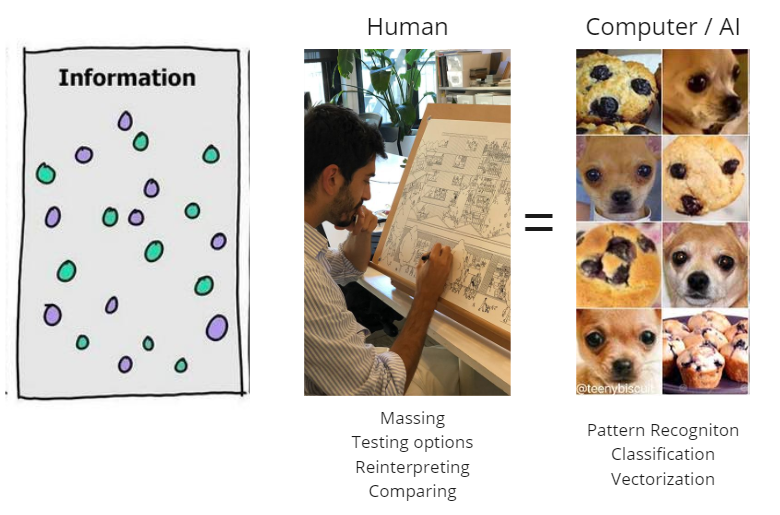
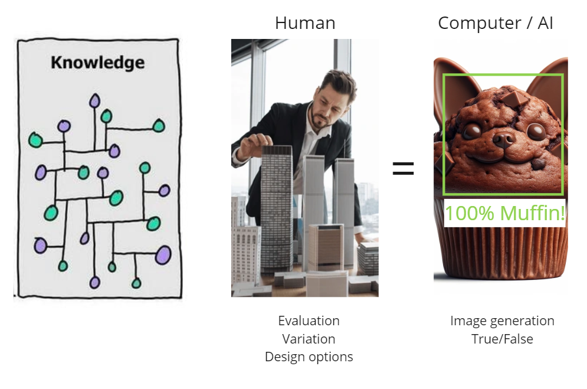
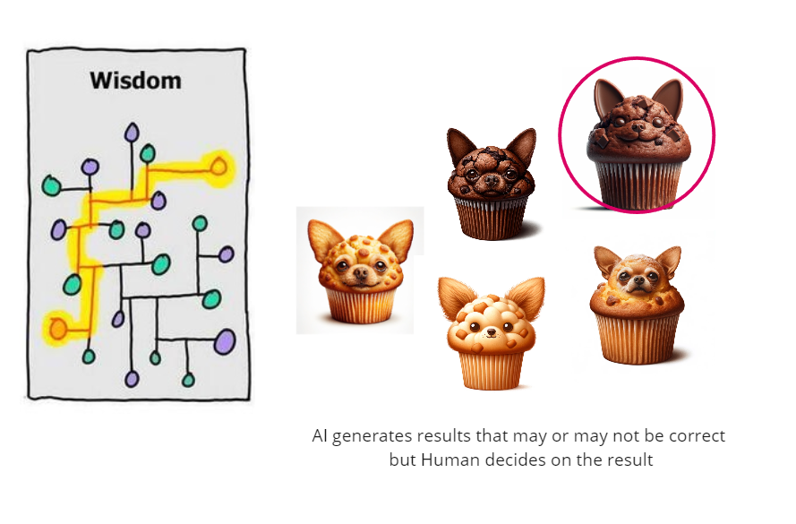

# **건축가들을 위한 생성형 AI - Intro**

  

     "AI 시대의 도래는 많은 변화와 도전을 가져오고 있습니다."
       
     <b>창의성,</b> 인간만이 할 수 있다고 여겨졌던 분야에서 AI의 역할이 점점 커지고 있습니다.   

     일부에서는, 직업 상실이나 기업의 몰락 같은 <b>부정적인 전망</b>으로 이어지기도 합니다. 
      
     <b>하지만,</b> 이러한 시각은 AI와 기술에 대한 깊은 이해가 부족할 때 나타납니다.
       
     기술과 도구의 발전은 생산성 향상과 개인 역량 강화에 중요한 역할을 합니다. 
      강의는 AI 이미지 생성 도구의 기본 사용법과 디자인 아이디어 시각화에 도움을 주는 세부 활용법에 초점을 맞추어, 건축 및 디자인 분야에서 AI의 유용성을 탐색합니다.       

----

###**0. DIKW 모델**
  

 DIKW 모델은 다양한 주제에 대해 구조적이고 기능적으로 접근하는 데 도움을 줍니다. 

  

| 1. 데이터 (Data) | 2. 정보 (Information) | 3. 지식 (Knowledge) | 4. 지혜 (Wisdom) |
| --- | --- | --- | --- |
| 데이터는 자극이나 신호로, 기계나 유기체가 감각 기관이나 입력 장치를 통해 받는 에너지의 한 형태입니다.   이는 문자, 숫자, 이미지, 소리 등 다양한 형태로 나타날 수 있으며, 자체적으로는 유용하지 않은 상태입니다. | 정보는 데이터가 특정한 가치를 가지게 되는 단계입니다.   유기체나 기계가 데이터를 처리하여 새로운 의미를 창출하며, 이렇게 생성된 정보는 유용하고 목적을 가집니다. | 지식은 데이터를 정보로 변환하는 과정에서 발생하는 의식의 내용입니다.   개념, 명제, 계산 및 그 결과로 구성되며, 진실로 믿어지고 정당화될 수 있는 믿음의 형태를 취합니다. | 지혜는 가치 있는 지식의 축적입니다. 단순히 참과 거짓을 넘어서 좋고 나쁨, 옳고 그름의 관점에서 평가됩니다.   다양한 상황에 적용될 수 있는 법칙, 원칙, 격언 등의 형태를 취하며, 개인의 목적을 넘어서 더 큰 선을 위해 사용됩니다. |

----
###**1. 디자인 프로세스와 DIKW 모델**

**1. 영감(Inspiration) 수집 단계 : 데이터(Data)와의 유사성**

  

 
  

  창조적 디자인의 첫 단계는 영감을 리서치하고 수집하는 과정입니다.   'DIKW 모델'에서 '데이터'에 해당합니다. 디자이너나 AI는 주변 환경에서 다양한 자극과 신호를 수집합니다. 디자이너는 이를 통해 창의적 영감을 얻으며, AI는 이 데이터를 기계 학습과 패턴 인식의 기초로 사용합니다.
  

----

**2. 선택적 취합 및 변형 단계 : 정보(Information)와의 연결** 

  

 
 수집된 데이터(영감)는 이후 인간의 뇌에서 처리되어 새로운 의미를 창출하고 유용한 형태로 (스케치, 글, 음악, 멜로디 등등) 변형됩니다. 이는 DIKW 모델의 '정보' 단계와 연결됩니다.  디자인에서는 이 과정에서 수집된 자료로부터 창의적인 아이디어가 도출되며,  AI는 데이터를 분석하여 패턴을 인식하고 이를 의미 있는 형태로 변환합니다.

 ----

**3. 최적 옵션 도출 단계 - 지식(Knowledge)의 반영**

  

 

 
 세 번째 단계에서는 이전 단계에서 얻은 정보를 바탕으로 의식적인  판단이 이루어집니다. 디자인에서는 이를 통해 최적의 디자인 옵션이 도출됩니다.   AI의 경우, 분석된 데이터를 바탕으로 최적의 솔루션을 결정하고 이를 결과물로 제시합니다. 결과물은 True/False, classification 혹은 image generation 같은 결과물입니다. 

----

###**4. 지혜 + 직관 그리고 판단 : your design is what you decide**

  

 

 예술 창조의 핵심적인 부분인 <b>결정</b>은 AI가 아닌 인간 디자이너에 의해 이루어집니다.   AI는 디자인 프로세스에서 중요한 도구로서의 역할을 수행할 수 있으며 데이터와 정보의 처리에 강점을 가지고 있습니다만, 최종 결정의 단계에서는 여전히 인간 디자이너의 직관과 판단이 필수적입니다. 맞다 / 아니다의 개념이 아닌 좋고 / 싫음의 결정은 인간만이 할 수 있는 영역이며 좋은 디자이너는 이 결정, 직관의 능력이 뛰어납니다.

----

### **2. AI시대의 창의성 : Creativity in the Age of AI**

    <iframe width="1200" height="400" src="https://www.youtube.com/embed/y7g-nRooZr8?si=yEgNCnAv8hDv1WNb"  frameborder="0" allow="accelerometer; autoplay; clipboard-write; encrypted-media; gyroscope; picture-in-picture" allowfullscreen></iframe>

 
 "AI가 예술을 만들어낸다는 관점은 오해의 소지가 있습니다."  

 하버드 GSD의 로페즈 교수에 따르면, AI는 예술을 창조하는 것이 아니라 이미지를 생성하는 수준에 머무르며, 통계에 기반을 두고 있어 창의력을 대체하지 않는다고 설명합니다.  그는 AI를 건축가들이 흥미로운 디자인을 빠르게 찾고 프로젝트를 빠르게 진행하는 데 도움되는 '리소스'로 간주합니다.
   
 AI는 사용자에게 도구로 작용하며, 사용자의 역량과 결정에 따라 다양하게 활용됩니다.  
 AI를 효과적으로 활용하려면 이를 단순한 데이터 처리 및 이미지 생성 도구로 이해하고, 창의적인 디자인 프로세스에 통합하는 방법을 알아야 합니다.  
 AI는 창의적인 디자인의 일부분이지만, 전체 과정의 핵심은 여전히 인간의 창의성과 판단에 달려 있습니다.

    출처 -https://www.internetmap.kr/entry/Basic-Theory-of-Stable-Diffusion