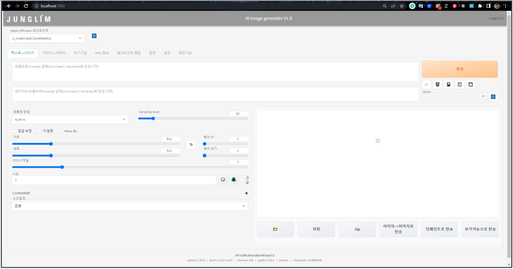

# Stable diffusion Webui 설치 방법
----

  <a href="https://huggingface.co/SKyu/JL_architecture/resolve/main/SD_Arc.zip" download style="
      display: inline-block;
      padding: 12px 24px;
      margin: 4px 2px;
      cursor: pointer;
      text-align: center;
      text-decoration: none;
      outline: none;
      color: #fff;
      background-color: #4CAF50;
      border: none;
      border-radius: 15px;
      ">
    Download Stable Diffusion webui
  </a>

----

### **1. 설치파일 다운로드** 

첨부된 파일안에는 실행을 위한 설치 파일들이 들어있습니다. 

총 설치 시간은 약 15분 정도 예상되며 설치하셔야 하는 프로그램은 총 3가지 입니다. 

로컬에서 실행되어야 하는 프로그램이기에 선제적으로 **"Git과 Python"**이 필요합니다. 
 Git과 Python의 설치 순서는 상관없으나 파이썬을 설치시에 **Add Python 3.10 to PATH란을 체크** ✅ 해주셔야합니다. 

  

----

### **2. Webui-user.bat** 
JL_StableDiffusion_v1.0.zip을 압축해제 하신후 압축해제한 폴더에 들어가 **‘Webui-user.bat’** 배치 파일을 실행시켜주시면 자동으로 cmd 창이 실행되며 stable diffusion webui 가 설치 시작됩니다.

해당 프로그램은 stable diffusion에 요구되는 건축 특화 체크포인트와 stable diffusion webui 번역본이 함께 들어있고 이를 자동적으로 로드해줍니다 (2.8gb).  설치는 약 5~10분 정도 소요됩니다.

  

 ----

### **3.http://127.0.0.1:7860** 
설치가 성공적으로 완료되면 Running on local URL: <u>**http://127.0.0.1:7860**</u>이 출력되며 프로그램이 작동 준비에 들어간 것을 알 수 있습니다

  

----

### **4.웹 브라우저에서 실행** 

웹브라우저에 **http://localhost:7860** 혹은 **http://127.0.0.1:7860** 을 입력하여 webui를 실행시켜줍니다. 

  

----